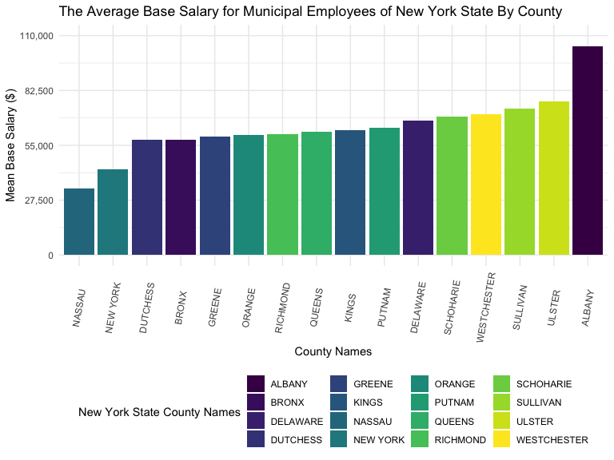
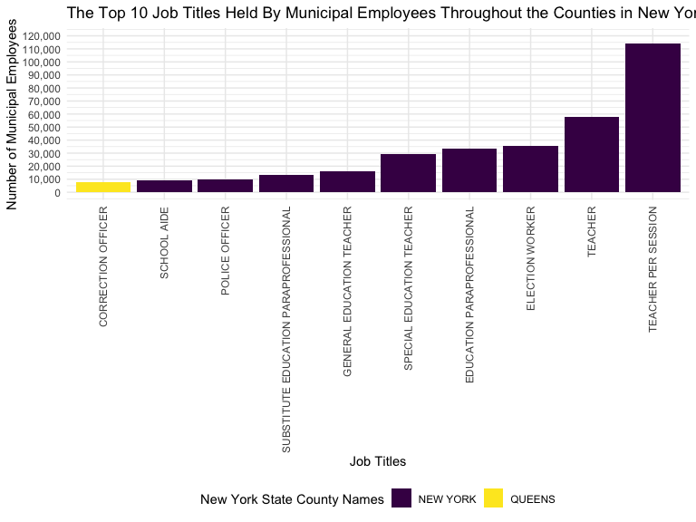
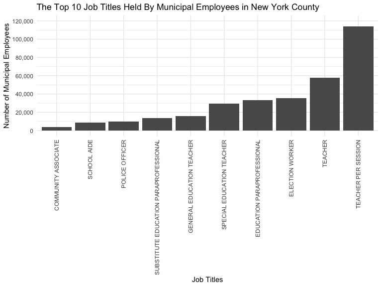
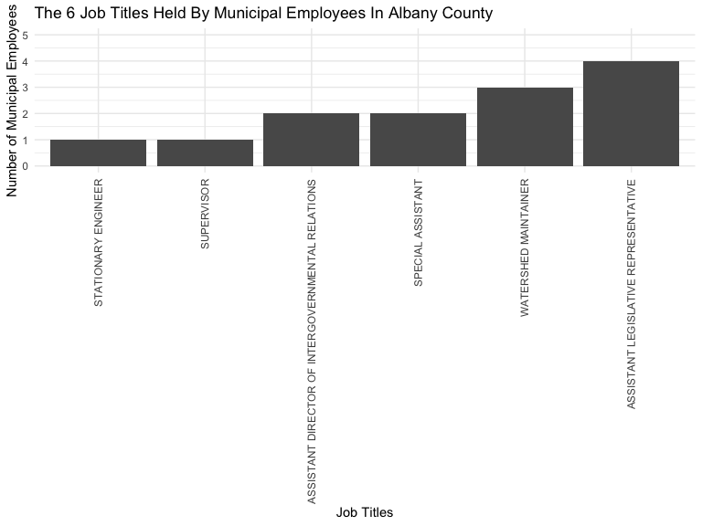

New York State Municipal Employee Salaries
================
Nergui Ravzanaadii, Varvara Rousseau, Justin Vargas

# Libraries and Settings for Plots

``` r
library(tidyverse)
```

    ## ── Attaching packages ─────────────────────────────────────── tidyverse 1.3.2 ──
    ## ✔ ggplot2 3.4.0      ✔ purrr   0.3.4 
    ## ✔ tibble  3.1.8      ✔ dplyr   1.0.10
    ## ✔ tidyr   1.2.1      ✔ stringr 1.4.1 
    ## ✔ readr   2.1.2      ✔ forcats 0.5.2 
    ## ── Conflicts ────────────────────────────────────────── tidyverse_conflicts() ──
    ## ✖ dplyr::filter() masks stats::filter()
    ## ✖ dplyr::lag()    masks stats::lag()

``` r
library(janitor)
```

    ## 
    ## Attaching package: 'janitor'
    ## 
    ## The following objects are masked from 'package:stats':
    ## 
    ##     chisq.test, fisher.test

``` r
library(viridis)
```

    ## Loading required package: viridisLite

``` r
knitr::opts_chunk$set(
    echo = TRUE,
    warning = FALSE,
    fig.width = 8, 
  fig.height = 6,
  out.width = "90%"
)

options(
  ggplot2.continuous.colour = "viridis",
  ggplot2.continuous.fill = "viridis"
)

scale_colour_discrete = scale_colour_viridis_d

scale_fill_discrete = scale_fill_viridis_d

theme_set(theme_minimal() + theme(legend.position = "bottom"))
```

# Cleaning and Organizing Data

``` r
 payroll_data = 
    read_csv("data/Citywide_Payroll_Data__Fiscal_Year_.csv") %>% 
    clean_names() %>%
    filter(fiscal_year == "2022",
           work_location_borough != "NA",
           work_location_borough != "OTHER",
           work_location_borough != "WASHINGTON DC",
           leave_status_as_of_june_30 != "ON SEPARATION LEAVE",
           leave_status_as_of_june_30 != "SEASONAL",
           title_description != "NA") %>%
       separate(agency_start_date, into = c("month", "day", "start_year"), convert = TRUE) %>% 
      mutate(leave_status = leave_status_as_of_june_30,
             pay_basis = recode(pay_basis, "per Annum" = "Annually"),
             pay_basis = recode(pay_basis, "per Day" = "Daily"),
             pay_basis = recode(pay_basis, "per Hour" = "Hourly"),
             county_name = work_location_borough,
             county_name = recode(county_name, "MANHATTAN" = "NEW YORK"),
             county_name = recode(county_name, "BROOKLYN" = "KINGS",
             job_title = title_description)) %>% 
    select(-payroll_number, -first_name, -last_name, -mid_init, -month, -day, -leave_status_as_of_june_30, -regular_hours, -ot_hours, -regular_gross_paid, -work_location_borough) %>% 
    mutate(county_name = as.factor(county_name),
           pay_basis = as.factor(pay_basis),
           leave_status = as.factor(leave_status),
           job_title = title_description) %>%
  select(-title_description)
```

    ## Rows: 5109775 Columns: 17
    ## ── Column specification ────────────────────────────────────────────────────────
    ## Delimiter: ","
    ## chr (9): Agency Name, Last Name, First Name, Mid Init, Agency Start Date, Wo...
    ## dbl (2): Fiscal Year, Payroll Number
    ## 
    ## ℹ Use `spec()` to retrieve the full column specification for this data.
    ## ℹ Specify the column types or set `show_col_types = FALSE` to quiet this message.

``` r
head(payroll_data)
```

    ## # A tibble: 6 × 10
    ##   fiscal_year agency_n…¹ start…² base_…³ pay_b…⁴ total…⁵ total…⁶ leave…⁷ count…⁸
    ##         <dbl> <chr>        <int>   <dbl> <fct>     <dbl>   <dbl> <fct>   <fct>  
    ## 1        2022 DEPT OF E…    1988  128409 Annual…       0   8259. CEASED  NEW YO…
    ## 2        2022 DEPT OF E…    2015   97469 Annual…       0   1486. ACTIVE  NEW YO…
    ## 3        2022 DEPT OF E…    2000  169456 Annual…       0  16947. ACTIVE  NEW YO…
    ## 4        2022 DEPT OF E…    2000   92906 Annual…       0   4426. CEASED  NEW YO…
    ## 5        2022 DEPT OF E…    2007  100351 Annual…       0   4852. ACTIVE  NEW YO…
    ## 6        2022 DEPT OF E…    2022   69866 Annual…       0   2801. ACTIVE  NEW YO…
    ## # … with 1 more variable: job_title <chr>, and abbreviated variable names
    ## #   ¹​agency_name, ²​start_year, ³​base_salary, ⁴​pay_basis, ⁵​total_ot_paid,
    ## #   ⁶​total_other_pay, ⁷​leave_status, ⁸​county_name

# Pie Chart for Percentages of Municipal Employees by Leave Status Across All Counties Plot

``` r
Total_ls = table(pull(payroll_data,leave_status))

Total_ls
```

    ## 
    ##   ACTIVE   CEASED ON LEAVE 
    ##   481781   102360    10093

``` r
labels = c("Active", "Ceased", "On Leave")

piepercent = round(100 * Total_ls / sum(Total_ls), 1)

par(xpd = TRUE) 

pie(Total_ls, labels = paste(labels, sep = " ", piepercent, "%"),
    main = "Percentages of Municipal Employees by Leave Status Across All Counties", col =       viridis(length(Total_ls)))
legend("topright", c("Active", "Ceased", "On Leave"),cex = 0.9, fill = viridis(length(Total_ls)))
```


# Bar Graph for the Number of Municipal Employees by Leave Status in New York State Plot

``` r
Ls_bar = 
  payroll_data %>%
  group_by(leave_status) %>%
  summarise(
    count = n()
    )

ggplot(Ls_bar, aes(x = leave_status, y = count, fill = leave_status)) + 
geom_bar(position = "dodge", stat = "identity") + 
labs(
    title = "The Number of Municipal Employees by Leave Status in New York State",
    x = "Leave Status", 
    y = "Number of Municipal Employees", 
    fill = "Leave Status" 
    ) + 
scale_y_continuous(labels = scales::comma)
```


# ANOVA Analysis

Null Hypothesis(Ho) = The mean base salary is constant for all counties

Alternative Hypothesis(H1) = The mean base salary is different for all
municipalities

``` r
ms_model = 
  payroll_data %>%
  mutate(county_name = as.factor(county_name)) %>%
  group_by(county_name) %>%
  summarise(ms_mean = base_salary)
```

    ## `summarise()` has grouped output by 'county_name'. You can override using the
    ## `.groups` argument.

``` r
res = lm(ms_mean ~ factor(county_name), data = ms_model)

anova_analysis = 
    anova(res) %>% 
    broom::tidy() %>% 
    knitr::kable(caption = "One Way Anova Test for Mean Salary by County")

anova_analysis
```

| term                |     df |        sumsq |       meansq | statistic | p.value |
|:--------------------|-------:|-------------:|-------------:|----------:|--------:|
| factor(county_name) |     15 | 3.805341e+13 | 2.536894e+12 |  1199.016 |       0 |
| Residuals           | 594218 | 1.257254e+15 | 2.115813e+09 |        NA |      NA |

One Way Anova Test for Mean Salary by County

# Tukey test for Mean Salary by County

``` r
res1 = aov(ms_mean ~ factor(county_name), data = ms_model)

tukey_ms = TukeyHSD(res1)

tukey_ms
```

    ##   Tukey multiple comparisons of means
    ##     95% family-wise confidence level
    ## 
    ## Fit: aov(formula = ms_mean ~ factor(county_name), data = ms_model)
    ## 
    ## $`factor(county_name)`
    ##                                diff          lwr           upr     p adj
    ## BRONX-ALBANY          -46793.672635  -90512.1734  -3075.171912 0.0222448
    ## DELAWARE-ALBANY       -37028.785191  -84073.8941  10016.323741 0.3324215
    ## DUTCHESS-ALBANY       -46795.579199  -99123.4667   5532.308303 0.1432005
    ## GREENE-ALBANY         -44972.509532 -111258.7702  21313.751087 0.6052943
    ## KINGS-ALBANY          -41916.067279  -85629.6490   1797.514460 0.0771545
    ## NASSAU-ALBANY         -71164.422020 -121325.2335 -21003.610556 0.0001341
    ## NEW YORK-ALBANY       -61724.589860 -105433.0877 -18016.091985 0.0001499
    ## ORANGE-ALBANY         -44452.301533 -207992.1609 119087.557797 0.9999216
    ## PUTNAM-ALBANY         -40564.933675  -90581.7796   9451.912253 0.2812590
    ## QUEENS-ALBANY         -42864.041768  -86576.6770    848.593477 0.0615951
    ## RICHMOND-ALBANY       -43922.761054  -87668.6783   -176.843758 0.0478351
    ## SCHOHARIE-ALBANY      -35125.034981  -87724.9749  17474.904960 0.6329486
    ## SULLIVAN-ALBANY       -31241.821142  -77115.5638  14631.921470 0.5985696
    ## ULSTER-ALBANY         -27363.261353  -71913.6099  17187.087178 0.7627319
    ## WESTCHESTER-ALBANY    -33863.274624  -78097.0292  10370.479944 0.3822703
    ## DELAWARE-BRONX          9764.887443   -7664.8141  27194.588979 0.8674314
    ## DUTCHESS-BRONX            -1.906564  -28790.0991  28786.286008 1.0000000
    ## GREENE-BRONX            1821.163102  -48022.7991  51665.125305 1.0000000
    ## KINGS-BRONX             4877.605356    3682.0094   6073.201277 0.0000000
    ## NASSAU-BRONX          -24370.749386  -49001.2026    259.703877 0.0560434
    ## NEW YORK-BRONX        -14930.917225  -15923.3927 -13938.441725 0.0000000
    ## ORANGE-BRONX            2341.371101 -155252.5305 159935.272668 1.0000000
    ## PUTNAM-BRONX            6228.738959  -18107.1830  30564.660922 0.9999637
    ## QUEENS-BRONX            3929.630867    2769.1563   5090.105448 0.0000000
    ## RICHMOND-BRONX          2870.911581     807.5403   4934.282908 0.0002127
    ## SCHOHARIE-BRONX        11668.637654  -17611.1489  40948.424246 0.9932456
    ## SULLIVAN-BRONX         15551.851493    1589.3130  29514.390032 0.0129459
    ## ULSTER-BRONX           19430.411282   10753.6737  28107.148885 0.0000000
    ## WESTCHESTER-BRONX      12930.398011    6061.8272  19798.968775 0.0000000
    ## DUTCHESS-DELAWARE      -9766.794007  -43392.6026  23859.014541 0.9998199
    ## GREENE-DELAWARE        -7943.724341  -60729.6651  44842.216373 1.0000000
    ## KINGS-DELAWARE         -4887.282087  -22304.6418  12530.077603 0.9998829
    ## NASSAU-DELAWARE       -34135.636829  -64278.5331  -3992.740537 0.0101729
    ## NEW YORK-DELAWARE     -24695.804668  -42100.4011  -7291.208247 0.0001337
    ## ORANGE-DELAWARE        -7423.516342 -165972.4765 151125.443856 1.0000000
    ## PUTNAM-DELAWARE        -3536.148484  -33438.8585  26366.561540 1.0000000
    ## QUEENS-DELAWARE        -5835.256577  -23250.2406  11579.727495 0.9989983
    ## RICHMOND-DELAWARE      -6893.975863  -24392.3321  10604.380352 0.9940052
    ## SCHOHARIE-DELAWARE      1903.750211  -32143.8763  35951.376734 1.0000000
    ## SULLIVAN-DELAWARE       5786.964050  -16504.0084  28077.936469 0.9999564
    ## ULSTER-DELAWARE         9665.523839   -9756.6476  29087.695303 0.9460342
    ## WESTCHESTER-DELAWARE    3165.510568  -15519.0347  21850.055874 0.9999999
    ## GREENE-DUTCHESS         1823.069667  -55721.0097  59367.149058 1.0000000
    ## KINGS-DUTCHESS          4879.511920  -23901.2100  33660.233845 0.9999999
    ## NASSAU-DUTCHESS       -24368.842821  -62231.2217  13493.536037 0.6937833
    ## NEW YORK-DUTCHESS     -14929.010661  -43702.0104  13843.989053 0.9245775
    ## ORANGE-DUTCHESS         2343.277666 -157852.6596 162539.214930 1.0000000
    ## PUTNAM-DUTCHESS         6230.645524  -31440.7973  43902.088325 0.9999999
    ## QUEENS-DUTCHESS         3931.537431  -24847.7469  32710.821755 1.0000000
    ## RICHMOND-DUTCHESS       2872.818145  -25956.9929  31702.629212 1.0000000
    ## SCHOHARIE-DUTCHESS     11670.544218  -29368.5397  52709.628124 0.9998615
    ## SULLIVAN-DUTCHESS      15553.758057  -16412.6773  47520.193382 0.9553143
    ## ULSTER-DUTCHESS        19432.317846  -10604.0981  49468.733750 0.6855515
    ## WESTCHESTER-DUTCHESS   12932.304575  -16632.5017  42497.110837 0.9829191
    ## KINGS-GREENE            3056.442253  -46783.2055  52896.090036 1.0000000
    ## NASSAU-GREENE         -26191.912488  -81772.6670  29388.841999 0.9661308
    ## NEW YORK-GREENE       -16752.080328  -66587.2692  33083.108536 0.9989603
    ## ORANGE-GREENE            520.207999 -164762.5765 165802.992500 1.0000000
    ## PUTNAM-GREENE           4407.575857  -51043.2865  59858.438242 1.0000000
    ## QUEENS-GREENE           2108.467764  -47730.3499  51947.285394 1.0000000
    ## RICHMOND-GREENE         1049.748478  -48818.2627  50917.759695 1.0000000
    ## SCHOHARIE-GREENE        9847.474552  -47944.1074  67639.056502 0.9999999
    ## SULLIVAN-GREENE        13730.688390  -38014.0072  65475.384002 0.9999423
    ## ULSTER-GREENE          17609.248179  -32965.9119  68184.408257 0.9984440
    ## WESTCHESTER-GREENE     11109.234909  -39187.2690  61405.738821 0.9999948
    ## NASSAU-KINGS          -29248.354742  -53870.0759  -4626.633623 0.0048128
    ## NEW YORK-KINGS        -19808.522581  -20553.4592 -19063.585952 0.0000000
    ## ORANGE-KINGS           -2536.234255 -160128.7713 155056.302796 1.0000000
    ## PUTNAM-KINGS            1351.133603  -22975.9505  25678.217702 1.0000000
    ## QUEENS-KINGS            -947.974489   -1905.3794      9.430451 0.0556275
    ## RICHMOND-KINGS         -2006.693775   -3963.0742    -50.313394 0.0375474
    ## SCHOHARIE-KINGS         6791.032298  -22481.4091  36063.473704 0.9999900
    ## SULLIVAN-KINGS         10674.246137   -3272.8828  24621.375068 0.3827873
    ## ULSTER-KINGS           14552.805926    5900.8872  23204.724696 0.0000010
    ## WESTCHESTER-KINGS       8052.792655    1215.6012  14889.984133 0.0055358
    ## NEW YORK-NASSAU         9439.832160  -15172.8619  34052.526220 0.9954854
    ## ORANGE-NASSAU          26712.120487 -132789.0943 186213.335254 0.9999999
    ## PUTNAM-NASSAU          30599.488345   -3998.7312  65197.707939 0.1562546
    ## QUEENS-NASSAU          28300.380252    3680.3396  52920.420921 0.0081241
    ## RICHMOND-NASSAU        27241.660966    2562.5767  51920.745278 0.0146993
    ## SCHOHARIE-NASSAU       36039.387040   -2198.1025  74276.876551 0.0909144
    ## SULLIVAN-NASSAU        39922.600878   11642.7108  68202.490972 0.0001511
    ## ULSTER-NASSAU          43801.160667   17722.7122  69879.609178 0.0000010
    ## WESTCHESTER-NASSAU     37301.147397   11767.3078  62834.987014 0.0000647
    ## ORANGE-NEW YORK        17272.288326 -140318.8386 174863.415272 1.0000000
    ## PUTNAM-NEW YORK        21159.656185   -3158.2915  45477.603852 0.1767366
    ## QUEENS-NEW YORK        18860.548092   18173.3929  19547.703264 0.0000000
    ## RICHMOND-NEW YORK      17801.828806   15962.5403  19641.117312 0.0000000
    ## SCHOHARIE-NEW YORK     26599.554879   -2665.2941  55864.403826 0.1253369
    ## SULLIVAN-NEW YORK      30482.768718   16551.5820  44413.955438 0.0000000
    ## ULSTER-NEW YORK        34361.328507   25735.1326  42987.524448 0.0000000
    ## WESTCHESTER-NEW YORK   27861.315236   21056.7032  34665.927298 0.0000000
    ## PUTNAM-ORANGE           3887.367858 -155568.6304 163343.366121 1.0000000
    ## QUEENS-ORANGE           1588.259765 -156004.0147 159180.534277 1.0000000
    ## RICHMOND-ORANGE          529.540479 -157071.9690 158131.049944 1.0000000
    ## SCHOHARIE-ORANGE        9327.266553 -150957.7427 169612.275793 1.0000000
    ## SULLIVAN-ORANGE        13210.480392 -144994.8633 171415.824065 1.0000000
    ## ULSTER-ORANGE          17089.040181 -140737.6498 174915.730128 1.0000000
    ## WESTCHESTER-ORANGE     10589.026910 -147148.5892 168326.643060 1.0000000
    ## QUEENS-PUTNAM          -2299.108093  -26624.4914  22026.275201 1.0000000
    ## RICHMOND-PUTNAM        -3357.827379  -27742.9678  21027.313022 1.0000000
    ## SCHOHARIE-PUTNAM        5439.898695  -32608.5372  43488.334589 1.0000000
    ## SULLIVAN-PUTNAM         9323.112533  -18700.6284  37346.853426 0.9990780
    ## ULSTER-PUTNAM          13201.672323  -12598.7801  39002.124772 0.9324023
    ## WESTCHESTER-PUTNAM      6701.659052  -18548.1892  31951.507279 0.9999421
    ## RICHMOND-QUEENS        -1058.719286   -2993.8358    876.397208 0.8878165
    ## SCHOHARIE-QUEENS        7739.006787  -21532.0212  37010.034742 0.9999449
    ## SULLIVAN-QUEENS        11622.220626   -2321.9415  25566.382740 0.2377715
    ## ULSTER-QUEENS          15500.780415    6853.6450  24147.915782 0.0000001
    ## WESTCHESTER-QUEENS      9000.767144    2169.6297  15831.904601 0.0007032
    ## SCHOHARIE-RICHMOND      8797.726073  -20522.9812  38118.433389 0.9997313
    ## SULLIVAN-RICHMOND      12680.939912   -1367.2079  26729.087727 0.1327340
    ## ULSTER-RICHMOND        16559.499701    7745.6611  25373.338254 0.0000000
    ## WESTCHESTER-RICHMOND   10059.486430    3018.5178  17100.455038 0.0001131
    ## SULLIVAN-SCHOHARIE      3883.213839  -28526.6436  36293.071270 1.0000000
    ## ULSTER-SCHOHARIE        7761.773628  -22746.1295  38269.676730 0.9999665
    ## WESTCHESTER-SCHOHARIE   1261.760357  -28781.9352  31305.455879 1.0000000
    ## ULSTER-SULLIVAN         3878.559789  -12503.7090  20260.828595 0.9999869
    ## WESTCHESTER-SULLIVAN   -2621.453482  -18122.1057  12879.198767 0.9999999
    ## WESTCHESTER-ULSTER     -6500.013271  -17481.9764   4481.949811 0.8099179

``` r
tukey_table = 
    tukey_ms %>% 
    broom::tidy() %>%
    knitr::kable(caption = "Tukey Test for Mean Salary by County")

tukey_table
```

| term                | contrast              | null.value |      estimate |     conf.low |     conf.high | adj.p.value |
|:--------------------|:----------------------|-----------:|--------------:|-------------:|--------------:|------------:|
| factor(county_name) | BRONX-ALBANY          |          0 | -46793.672635 |  -90512.1734 |  -3075.171912 |   0.0222448 |
| factor(county_name) | DELAWARE-ALBANY       |          0 | -37028.785191 |  -84073.8941 |  10016.323741 |   0.3324215 |
| factor(county_name) | DUTCHESS-ALBANY       |          0 | -46795.579199 |  -99123.4667 |   5532.308303 |   0.1432005 |
| factor(county_name) | GREENE-ALBANY         |          0 | -44972.509532 | -111258.7702 |  21313.751087 |   0.6052943 |
| factor(county_name) | KINGS-ALBANY          |          0 | -41916.067279 |  -85629.6490 |   1797.514460 |   0.0771545 |
| factor(county_name) | NASSAU-ALBANY         |          0 | -71164.422020 | -121325.2335 | -21003.610556 |   0.0001341 |
| factor(county_name) | NEW YORK-ALBANY       |          0 | -61724.589860 | -105433.0877 | -18016.091985 |   0.0001499 |
| factor(county_name) | ORANGE-ALBANY         |          0 | -44452.301533 | -207992.1609 | 119087.557797 |   0.9999216 |
| factor(county_name) | PUTNAM-ALBANY         |          0 | -40564.933675 |  -90581.7796 |   9451.912253 |   0.2812590 |
| factor(county_name) | QUEENS-ALBANY         |          0 | -42864.041768 |  -86576.6770 |    848.593477 |   0.0615951 |
| factor(county_name) | RICHMOND-ALBANY       |          0 | -43922.761054 |  -87668.6783 |   -176.843758 |   0.0478351 |
| factor(county_name) | SCHOHARIE-ALBANY      |          0 | -35125.034981 |  -87724.9749 |  17474.904959 |   0.6329486 |
| factor(county_name) | SULLIVAN-ALBANY       |          0 | -31241.821142 |  -77115.5638 |  14631.921470 |   0.5985696 |
| factor(county_name) | ULSTER-ALBANY         |          0 | -27363.261353 |  -71913.6099 |  17187.087179 |   0.7627319 |
| factor(county_name) | WESTCHESTER-ALBANY    |          0 | -33863.274624 |  -78097.0292 |  10370.479944 |   0.3822703 |
| factor(county_name) | DELAWARE-BRONX        |          0 |   9764.887443 |   -7664.8141 |  27194.588978 |   0.8674314 |
| factor(county_name) | DUTCHESS-BRONX        |          0 |     -1.906564 |  -28790.0991 |  28786.286008 |   1.0000000 |
| factor(county_name) | GREENE-BRONX          |          0 |   1821.163102 |  -48022.7991 |  51665.125305 |   1.0000000 |
| factor(county_name) | KINGS-BRONX           |          0 |   4877.605356 |    3682.0094 |   6073.201276 |   0.0000000 |
| factor(county_name) | NASSAU-BRONX          |          0 | -24370.749386 |  -49001.2026 |    259.703877 |   0.0560434 |
| factor(county_name) | NEW YORK-BRONX        |          0 | -14930.917225 |  -15923.3927 | -13938.441726 |   0.0000000 |
| factor(county_name) | ORANGE-BRONX          |          0 |   2341.371101 | -155252.5305 | 159935.272668 |   1.0000000 |
| factor(county_name) | PUTNAM-BRONX          |          0 |   6228.738959 |  -18107.1830 |  30564.660922 |   0.9999637 |
| factor(county_name) | QUEENS-BRONX          |          0 |   3929.630867 |    2769.1563 |   5090.105448 |   0.0000000 |
| factor(county_name) | RICHMOND-BRONX        |          0 |   2870.911581 |     807.5403 |   4934.282908 |   0.0002127 |
| factor(county_name) | SCHOHARIE-BRONX       |          0 |  11668.637654 |  -17611.1489 |  40948.424246 |   0.9932456 |
| factor(county_name) | SULLIVAN-BRONX        |          0 |  15551.851493 |    1589.3130 |  29514.390031 |   0.0129459 |
| factor(county_name) | ULSTER-BRONX          |          0 |  19430.411282 |   10753.6737 |  28107.148885 |   0.0000000 |
| factor(county_name) | WESTCHESTER-BRONX     |          0 |  12930.398011 |    6061.8272 |  19798.968775 |   0.0000000 |
| factor(county_name) | DUTCHESS-DELAWARE     |          0 |  -9766.794007 |  -43392.6026 |  23859.014541 |   0.9998199 |
| factor(county_name) | GREENE-DELAWARE       |          0 |  -7943.724341 |  -60729.6651 |  44842.216373 |   1.0000000 |
| factor(county_name) | KINGS-DELAWARE        |          0 |  -4887.282087 |  -22304.6418 |  12530.077603 |   0.9998829 |
| factor(county_name) | NASSAU-DELAWARE       |          0 | -34135.636829 |  -64278.5331 |  -3992.740537 |   0.0101729 |
| factor(county_name) | NEW YORK-DELAWARE     |          0 | -24695.804668 |  -42100.4011 |  -7291.208247 |   0.0001337 |
| factor(county_name) | ORANGE-DELAWARE       |          0 |  -7423.516342 | -165972.4765 | 151125.443856 |   1.0000000 |
| factor(county_name) | PUTNAM-DELAWARE       |          0 |  -3536.148484 |  -33438.8585 |  26366.561540 |   1.0000000 |
| factor(county_name) | QUEENS-DELAWARE       |          0 |  -5835.256576 |  -23250.2406 |  11579.727495 |   0.9989983 |
| factor(county_name) | RICHMOND-DELAWARE     |          0 |  -6893.975863 |  -24392.3321 |  10604.380352 |   0.9940052 |
| factor(county_name) | SCHOHARIE-DELAWARE    |          0 |   1903.750211 |  -32143.8763 |  35951.376734 |   1.0000000 |
| factor(county_name) | SULLIVAN-DELAWARE     |          0 |   5786.964050 |  -16504.0084 |  28077.936469 |   0.9999564 |
| factor(county_name) | ULSTER-DELAWARE       |          0 |   9665.523839 |   -9756.6476 |  29087.695303 |   0.9460342 |
| factor(county_name) | WESTCHESTER-DELAWARE  |          0 |   3165.510568 |  -15519.0347 |  21850.055874 |   0.9999999 |
| factor(county_name) | GREENE-DUTCHESS       |          0 |   1823.069667 |  -55721.0097 |  59367.149058 |   1.0000000 |
| factor(county_name) | KINGS-DUTCHESS        |          0 |   4879.511920 |  -23901.2100 |  33660.233845 |   0.9999999 |
| factor(county_name) | NASSAU-DUTCHESS       |          0 | -24368.842821 |  -62231.2217 |  13493.536037 |   0.6937833 |
| factor(county_name) | NEW YORK-DUTCHESS     |          0 | -14929.010661 |  -43702.0104 |  13843.989053 |   0.9245775 |
| factor(county_name) | ORANGE-DUTCHESS       |          0 |   2343.277665 | -157852.6596 | 162539.214930 |   1.0000000 |
| factor(county_name) | PUTNAM-DUTCHESS       |          0 |   6230.645524 |  -31440.7973 |  43902.088325 |   0.9999999 |
| factor(county_name) | QUEENS-DUTCHESS       |          0 |   3931.537431 |  -24847.7469 |  32710.821755 |   1.0000000 |
| factor(county_name) | RICHMOND-DUTCHESS     |          0 |   2872.818145 |  -25956.9929 |  31702.629212 |   1.0000000 |
| factor(county_name) | SCHOHARIE-DUTCHESS    |          0 |  11670.544218 |  -29368.5397 |  52709.628124 |   0.9998615 |
| factor(county_name) | SULLIVAN-DUTCHESS     |          0 |  15553.758057 |  -16412.6773 |  47520.193382 |   0.9553143 |
| factor(county_name) | ULSTER-DUTCHESS       |          0 |  19432.317846 |  -10604.0981 |  49468.733750 |   0.6855515 |
| factor(county_name) | WESTCHESTER-DUTCHESS  |          0 |  12932.304575 |  -16632.5017 |  42497.110837 |   0.9829191 |
| factor(county_name) | KINGS-GREENE          |          0 |   3056.442253 |  -46783.2055 |  52896.090036 |   1.0000000 |
| factor(county_name) | NASSAU-GREENE         |          0 | -26191.912488 |  -81772.6670 |  29388.841999 |   0.9661308 |
| factor(county_name) | NEW YORK-GREENE       |          0 | -16752.080328 |  -66587.2692 |  33083.108536 |   0.9989603 |
| factor(county_name) | ORANGE-GREENE         |          0 |    520.207999 | -164762.5765 | 165802.992500 |   1.0000000 |
| factor(county_name) | PUTNAM-GREENE         |          0 |   4407.575857 |  -51043.2865 |  59858.438242 |   1.0000000 |
| factor(county_name) | QUEENS-GREENE         |          0 |   2108.467764 |  -47730.3499 |  51947.285394 |   1.0000000 |
| factor(county_name) | RICHMOND-GREENE       |          0 |   1049.748478 |  -48818.2627 |  50917.759694 |   1.0000000 |
| factor(county_name) | SCHOHARIE-GREENE      |          0 |   9847.474551 |  -47944.1074 |  67639.056502 |   0.9999999 |
| factor(county_name) | SULLIVAN-GREENE       |          0 |  13730.688390 |  -38014.0072 |  65475.384002 |   0.9999423 |
| factor(county_name) | ULSTER-GREENE         |          0 |  17609.248179 |  -32965.9119 |  68184.408257 |   0.9984440 |
| factor(county_name) | WESTCHESTER-GREENE    |          0 |  11109.234909 |  -39187.2690 |  61405.738821 |   0.9999948 |
| factor(county_name) | NASSAU-KINGS          |          0 | -29248.354741 |  -53870.0759 |  -4626.633622 |   0.0048128 |
| factor(county_name) | NEW YORK-KINGS        |          0 | -19808.522581 |  -20553.4592 | -19063.585952 |   0.0000000 |
| factor(county_name) | ORANGE-KINGS          |          0 |  -2536.234255 | -160128.7713 | 155056.302796 |   1.0000000 |
| factor(county_name) | PUTNAM-KINGS          |          0 |   1351.133603 |  -22975.9505 |  25678.217702 |   1.0000000 |
| factor(county_name) | QUEENS-KINGS          |          0 |   -947.974489 |   -1905.3794 |      9.430451 |   0.0556275 |
| factor(county_name) | RICHMOND-KINGS        |          0 |  -2006.693775 |   -3963.0742 |    -50.313394 |   0.0375474 |
| factor(county_name) | SCHOHARIE-KINGS       |          0 |   6791.032298 |  -22481.4091 |  36063.473704 |   0.9999900 |
| factor(county_name) | SULLIVAN-KINGS        |          0 |  10674.246137 |   -3272.8828 |  24621.375068 |   0.3827873 |
| factor(county_name) | ULSTER-KINGS          |          0 |  14552.805926 |    5900.8872 |  23204.724696 |   0.0000010 |
| factor(county_name) | WESTCHESTER-KINGS     |          0 |   8052.792655 |    1215.6012 |  14889.984133 |   0.0055358 |
| factor(county_name) | NEW YORK-NASSAU       |          0 |   9439.832160 |  -15172.8619 |  34052.526220 |   0.9954854 |
| factor(county_name) | ORANGE-NASSAU         |          0 |  26712.120487 | -132789.0943 | 186213.335254 |   0.9999999 |
| factor(county_name) | PUTNAM-NASSAU         |          0 |  30599.488345 |   -3998.7312 |  65197.707939 |   0.1562546 |
| factor(county_name) | QUEENS-NASSAU         |          0 |  28300.380252 |    3680.3396 |  52920.420921 |   0.0081241 |
| factor(county_name) | RICHMOND-NASSAU       |          0 |  27241.660966 |    2562.5767 |  51920.745278 |   0.0146993 |
| factor(county_name) | SCHOHARIE-NASSAU      |          0 |  36039.387040 |   -2198.1025 |  74276.876551 |   0.0909144 |
| factor(county_name) | SULLIVAN-NASSAU       |          0 |  39922.600878 |   11642.7108 |  68202.490972 |   0.0001511 |
| factor(county_name) | ULSTER-NASSAU         |          0 |  43801.160668 |   17722.7122 |  69879.609178 |   0.0000010 |
| factor(county_name) | WESTCHESTER-NASSAU    |          0 |  37301.147396 |   11767.3078 |  62834.987014 |   0.0000647 |
| factor(county_name) | ORANGE-NEW YORK       |          0 |  17272.288326 | -140318.8386 | 174863.415272 |   1.0000000 |
| factor(county_name) | PUTNAM-NEW YORK       |          0 |  21159.656184 |   -3158.2915 |  45477.603852 |   0.1767366 |
| factor(county_name) | QUEENS-NEW YORK       |          0 |  18860.548092 |   18173.3929 |  19547.703264 |   0.0000000 |
| factor(county_name) | RICHMOND-NEW YORK     |          0 |  17801.828806 |   15962.5403 |  19641.117312 |   0.0000000 |
| factor(county_name) | SCHOHARIE-NEW YORK    |          0 |  26599.554879 |   -2665.2941 |  55864.403826 |   0.1253369 |
| factor(county_name) | SULLIVAN-NEW YORK     |          0 |  30482.768718 |   16551.5820 |  44413.955438 |   0.0000000 |
| factor(county_name) | ULSTER-NEW YORK       |          0 |  34361.328507 |   25735.1326 |  42987.524448 |   0.0000000 |
| factor(county_name) | WESTCHESTER-NEW YORK  |          0 |  27861.315236 |   21056.7032 |  34665.927298 |   0.0000000 |
| factor(county_name) | PUTNAM-ORANGE         |          0 |   3887.367858 | -155568.6304 | 163343.366121 |   1.0000000 |
| factor(county_name) | QUEENS-ORANGE         |          0 |   1588.259765 | -156004.0147 | 159180.534277 |   1.0000000 |
| factor(county_name) | RICHMOND-ORANGE       |          0 |    529.540479 | -157071.9690 | 158131.049944 |   1.0000000 |
| factor(county_name) | SCHOHARIE-ORANGE      |          0 |   9327.266553 | -150957.7427 | 169612.275793 |   1.0000000 |
| factor(county_name) | SULLIVAN-ORANGE       |          0 |  13210.480392 | -144994.8633 | 171415.824065 |   1.0000000 |
| factor(county_name) | ULSTER-ORANGE         |          0 |  17089.040181 | -140737.6498 | 174915.730128 |   1.0000000 |
| factor(county_name) | WESTCHESTER-ORANGE    |          0 |  10589.026910 | -147148.5892 | 168326.643060 |   1.0000000 |
| factor(county_name) | QUEENS-PUTNAM         |          0 |  -2299.108093 |  -26624.4914 |  22026.275201 |   1.0000000 |
| factor(county_name) | RICHMOND-PUTNAM       |          0 |  -3357.827379 |  -27742.9678 |  21027.313022 |   1.0000000 |
| factor(county_name) | SCHOHARIE-PUTNAM      |          0 |   5439.898695 |  -32608.5372 |  43488.334589 |   1.0000000 |
| factor(county_name) | SULLIVAN-PUTNAM       |          0 |   9323.112533 |  -18700.6284 |  37346.853426 |   0.9990780 |
| factor(county_name) | ULSTER-PUTNAM         |          0 |  13201.672323 |  -12598.7801 |  39002.124772 |   0.9324023 |
| factor(county_name) | WESTCHESTER-PUTNAM    |          0 |   6701.659052 |  -18548.1892 |  31951.507279 |   0.9999421 |
| factor(county_name) | RICHMOND-QUEENS       |          0 |  -1058.719286 |   -2993.8358 |    876.397209 |   0.8878165 |
| factor(county_name) | SCHOHARIE-QUEENS      |          0 |   7739.006787 |  -21532.0212 |  37010.034742 |   0.9999449 |
| factor(county_name) | SULLIVAN-QUEENS       |          0 |  11622.220626 |   -2321.9415 |  25566.382740 |   0.2377715 |
| factor(county_name) | ULSTER-QUEENS         |          0 |  15500.780415 |    6853.6450 |  24147.915782 |   0.0000001 |
| factor(county_name) | WESTCHESTER-QUEENS    |          0 |   9000.767144 |    2169.6297 |  15831.904601 |   0.0007032 |
| factor(county_name) | SCHOHARIE-RICHMOND    |          0 |   8797.726073 |  -20522.9812 |  38118.433389 |   0.9997313 |
| factor(county_name) | SULLIVAN-RICHMOND     |          0 |  12680.939912 |   -1367.2079 |  26729.087727 |   0.1327340 |
| factor(county_name) | ULSTER-RICHMOND       |          0 |  16559.499701 |    7745.6611 |  25373.338254 |   0.0000000 |
| factor(county_name) | WESTCHESTER-RICHMOND  |          0 |  10059.486430 |    3018.5178 |  17100.455038 |   0.0001131 |
| factor(county_name) | SULLIVAN-SCHOHARIE    |          0 |   3883.213839 |  -28526.6436 |  36293.071270 |   1.0000000 |
| factor(county_name) | ULSTER-SCHOHARIE      |          0 |   7761.773628 |  -22746.1295 |  38269.676730 |   0.9999665 |
| factor(county_name) | WESTCHESTER-SCHOHARIE |          0 |   1261.760357 |  -28781.9352 |  31305.455879 |   1.0000000 |
| factor(county_name) | ULSTER-SULLIVAN       |          0 |   3878.559789 |  -12503.7090 |  20260.828595 |   0.9999869 |
| factor(county_name) | WESTCHESTER-SULLIVAN  |          0 |  -2621.453482 |  -18122.1057 |  12879.198767 |   0.9999999 |
| factor(county_name) | WESTCHESTER-ULSTER    |          0 |  -6500.013271 |  -17481.9764 |   4481.949811 |   0.8099179 |

Tukey Test for Mean Salary by County

# Mean Base Salary By New York State Counties Plot

``` r
mean_base_salary_plot =
  payroll_data %>%
  group_by(county_name) %>%
  summarize(
  mean_base_salary = mean(base_salary, na.rm = TRUE)) %>%
  ggplot(aes(x = reorder(county_name, mean_base_salary), y = mean_base_salary, fill = county_name)) +
  geom_bar(position = "dodge", stat = "identity") +
  scale_y_continuous(
      labels = scales::comma) +
  labs(
    x = "County Names",
    y = "Mean Base Salary",
    title = "The Average Base Salary for Municipal Employees of New York State By County",
    fill = "New York State County Names"
  ) + 
  theme(axis.text.x = element_text(angle = 80, vjust = 0.5, hjust = 0.50)) 

mean_base_salary_plot
```



# Total Other Pay by New York Counties Plot

``` r
median_tibble =
  payroll_data %>%
  group_by(county_name) %>%
  summarise(median_total_other_pay = median(total_other_pay))

median_other_pay_plot =
  payroll_data %>%
  left_join(median_tibble, by = "county_name") %>%
  ggplot(aes(x = reorder(county_name, median_total_other_pay), y = total_other_pay, fill = county_name)) +
  geom_boxplot() +
    scale_y_continuous(
      labels = scales::comma,
    limits = c(-20000, 40000),
    breaks = seq(-20000, 40000, by = 10000)) +
  labs(
    x = "County Names",
    y = "Median Total Other Types of Pay",
    title = "The Median Total Other Pay for Municipal Employees of New York State By County",
    fill = "New York State County Names"
  ) + 
  theme(axis.text.x = element_text(angle = 90, vjust = 0.5, hjust = 0.5)) 

median_other_pay_plot
```


# Total Number of Job Titles by New York State Counties Plot

``` r
number_job_titles_plot =
  payroll_data %>%
  group_by(county_name, job_title) %>%
  summarise(count = n()) %>%
  ungroup() %>% 
  group_by(county_name) %>%
  summarise(count = n()) %>%
  ggplot(aes(x = reorder(county_name, count), y = count, fill = county_name)) +
  geom_bar(position = "dodge", stat = "identity") +
  scale_y_continuous(
      labels = scales::comma,
    limits = c(0, 1500),
    breaks = seq(0, 1500, by = 250)) +
  labs(
    x = "County Names",
    y = "Number of Job Titles",
    title = "The Number of Job Titles Held By Municipal Employees of New York State By County",
    fill = "New York State County Names"
  ) + 
  theme(axis.text.x = element_text(angle = 90, vjust = 0.5, hjust = 1)) 
```

    ## `summarise()` has grouped output by 'county_name'. You can override using the
    ## `.groups` argument.

``` r
number_job_titles_plot
```


# Median Overtime Paid By New York State Counties Plot

``` r
overtime_tibble = 
    payroll_data %>% 
    group_by(county_name) %>% 
    summarise(median_total_ot_paid = median(total_ot_paid))

median_ot_paid_plot = 
    payroll_data |> 
    left_join(overtime_tibble, by = "county_name") |> 
    ggplot(aes(x = reorder(county_name, median_total_ot_paid ), y = total_ot_paid,
               fill = county_name)) +
    geom_boxplot() +
     scale_y_continuous(
      labels = scales::comma,
    limits = c(-5000, 32500),
    breaks = seq(-5000, 32500, by = 5000)) +
    labs(
    x = "County Names",
    y = "Total Overtime Paid",
    title = "Total Overtime Paid By Each County",
    fill = "New York State County Names"
  ) + 
    theme(axis.text.x = element_text(angle = 90, vjust = 0.5, hjust = 1)) 


median_ot_paid_plot
```


# Median Base Salary By Pay basis By New York State Counties (Annually) Plot

``` r
pay_basis_tibble = 
    payroll_data %>%
    filter(pay_basis == "Annually") |> 
    group_by(county_name) %>% 
    summarise(median_base_salary = median(base_salary))

Median_base_salary_plot_annually =
    payroll_data %>%
    filter(pay_basis == "Annually") |> 
    left_join(pay_basis_tibble, by = "county_name") %>%
    ggplot(aes(x = reorder(county_name, median_base_salary), y = base_salary, 
               fill = county_name)) +
    geom_boxplot() +
    scale_y_continuous(
      labels = scales::comma,
    limits = c(20000, 150000),
    breaks = seq(20000, 150000, by = 10000)) +
    labs(
    x = "County Names",
    y = " Base Salary",
    title = "Annual Median Base Salary For Each County", 
    fill = "New York State County Names"
  ) + theme(axis.text.x = element_text(angle = 90, vjust = 0.5, hjust = 1)) 

Median_base_salary_plot_annually
```


# Median Base Salary By Pay basis By New York State Counties (Daily) Plot

``` r
pay_basis_daily_tibble = 
    payroll_data %>%
    filter(pay_basis == "Daily") |> 
    group_by(county_name) |> 
    summarise(median_base_salary_daily = median(base_salary))

Median_base_salary_plot_daily =
    payroll_data %>%
    filter(pay_basis == "Daily") |> 
    left_join(pay_basis_daily_tibble,  by = "county_name") %>%
    ggplot(aes(x = reorder(county_name, median_base_salary_daily) , 
               y = base_salary, fill = county_name)) +
    geom_boxplot() +
    scale_y_continuous(
      labels = scales::comma,
    limits = c(0,625),
    breaks = seq(0, 625, by = 50)) +
    labs(
    x = "County Names",
    y = " Base Salary",
    title = "Daily Median Base Salary For Each County", 
    fill = "New York State County Names"
  ) + theme(axis.text.x = element_text(angle = 90, vjust = 0.5, hjust = 1)) 

Median_base_salary_plot_daily
```


# Median Base Salary By Pay basis By New York State Counties (Hourly) Plot

``` r
pay_basis_hourly_tibble= 
    payroll_data %>%
    filter(pay_basis == "Hourly") |> 
    group_by(county_name) %>%
    summarise(median_base_salary_hourly = median(base_salary))

Median_base_salary_plot_hourly =
    payroll_data %>%
    filter(pay_basis == "Hourly") |> 
    left_join(pay_basis_hourly_tibble,  by = "county_name") %>%
    ggplot(aes(x = reorder(county_name, median_base_salary_hourly), 
               y = base_salary, fill = county_name)) +
    geom_boxplot() +
    scale_y_continuous(
      labels = scales::comma,
    limits = c(0,95),
    breaks = seq(0,95, by = 10)) +
    labs(
    x = "County Names",
    y = " Base Salary",
    title = "Hourly Median Base Salary For Each County",
     fill = "New York State County Names"
  ) + theme(axis.text.x = element_text(angle = 90, vjust = 0.5, hjust = 1)) 

Median_base_salary_plot_hourly
```


# Median Base Salary By Pay basis By New York State Counties (Prorated) Plot

``` r
pay_basis_prorated_tibble = 
    payroll_data %>%
    filter(pay_basis == "Prorated Annual") |> 
    group_by(county_name) %>%
    summarise(median_base_salary_prorated = median(base_salary))  
    
Median_base_salary_plot_prorated =
    payroll_data %>%
    filter(pay_basis == "Prorated Annual") |>
    left_join(pay_basis_prorated_tibble,  by = "county_name") %>%   
    ggplot(aes(x = reorder(county_name, median_base_salary_prorated), 
               y = base_salary, fill = county_name)) +
    geom_boxplot() +
    scale_y_continuous(
      labels = scales::comma,
    limits = c(5000,85000),
    breaks = seq(5000, 85000, by = 10000)) +
    labs(
    x = "County Names",
    y = " Base Salary",
    title = "Prorated Annual Median Base Salary For Each County",
    fill = "New York State County Names"
  ) + theme(axis.text.x = element_text(angle = 90, vjust = 0.5, hjust = 1))


Median_base_salary_plot_prorated
```


# Plot for Top 10 Job Titles Throughout the New York State Counties

``` r
job_frequency =
payroll_data %>%
    group_by(county_name, job_title) %>%
    summarise(job_frequency = n()) %>%
    arrange(desc(job_frequency)) %>%
    ungroup()
```

    ## `summarise()` has grouped output by 'county_name'. You can override using the
    ## `.groups` argument.

``` r
job_frequency_data = 
    job_frequency %>%
    top_n(job_frequency, n = 10) %>%
    mutate(
     job_title = recode(job_title, "TEACHER- PER SESSION" = "TEACHER PER SESSION"),
     job_title = recode(job_title, "ANNUAL ED PARA" = "EDUCATION PARAPROFESSIONAL"),
     job_title = recode(job_title, "TEACHER SPECIAL EDUCATION" = "SPECIAL EDUCATION TEACHER"),
     job_title = recode(job_title, "TEACHER-GENERAL ED" = "GENERAL EDUCATION TEACHER"),
     job_title = recode(job_title, "SUBSTITUTE ED PARA" = "SUBSTITUTE EDUCATION PARAPROFESSIONAL"),
     job_title = recode(job_title, "F/T SCHOOL AIDE" = "SCHOOL AIDE"))
    
job_frequency_plot =
    job_frequency_data %>%
    ggplot(aes(x = reorder(job_title, job_frequency), y = job_frequency, fill = county_name)) +
  geom_bar(position = "dodge", stat = "identity") + 
    scale_y_continuous(
      labels = scales::comma,
    limits = c(0, 120000),
    breaks = seq(0, 120000, by = 10000)) +
  labs(
    x = "Top 10 Job Titles",
    y = "Frequency of Job Titles",
    title = "The Top 10 Job Titles Held By Municipal Employees Throughout the Counties in New York State",
    fill = "New York State County Names"
  ) +
  theme(axis.text.x = element_text(angle = 90, vjust = 0.5, hjust = 1)) 

job_frequency_plot
```



# The Top Five Job Titles Held by Municipal Employees in Six New York State Counties Plot

``` r
top5_freq = 
  payroll_data %>%
   filter(county_name %in% c("NEW YORK", "KINGS", "BRONX", "QUEENS", "RICHMOND","ALBANY")) %>%
   group_by(county_name, job_title) %>%
   summarise(number_of_people = n()) %>%
   arrange(desc(number_of_people)) %>%
   slice(1:5)
```

    ## `summarise()` has grouped output by 'county_name'. You can override using the
    ## `.groups` argument.

``` r
top5_freq_n = 
  top5_freq %>%
   mutate(
     job_title = as.factor(job_title),
     job_title = recode(job_title, "TEACHER- PER SESSION" = "TEACHER PER SESSION"),
     job_title = recode(job_title, "ANNUAL ED PARA" = "EDUCATION PARAPROFESSIONAL"),
     job_title = recode(job_title, "TEACHER SPECIAL EDUCATION" = "SPECIAL EDUCATION TEACHER"),
     job_title = recode(job_title, "ASST DIR OF INTERGVNMENTAL RELTNS FOR THE ALBANY OFFICE" = "ASSISTANT DIRECTOR OF INTERNATIONAL RELATIONS"),
     job_title = recode(job_title, "EMERGENCY MEDICAL SPECIALIST-EMT" = "EMT"))
 
top_plot = 
  ggplot(top5_freq_n, aes(x = reorder(job_title, number_of_people), y = number_of_people)) + geom_point(aes(color = county_name), alpha = 0.5) + 
scale_y_continuous(
  labels = scales::comma,
  limits = c(0,120000),
  breaks = seq(0, 120000, by = 15000)) + 
labs(title = "The Top Five Job Titles Held by Municipal Employees in Six New York State Counties",x = "Job Title", y = "Number of Municipal Employees")  + 
  guides(color = guide_legend(title = "New York State County Names")) +
theme(axis.text.x = element_text(angle = 90, vjust = 0.5, hjust = 1)) 

top_plot
```


# Plot for Top 10 Job Titles Throughout the New York County

``` r
job_frequency_newyork =
payroll_data %>%
    filter(county_name == "NEW YORK") |> 
    group_by(county_name, job_title) %>%
    summarise(job_frequency = n()) %>%
    arrange(desc(job_frequency)) %>%
    ungroup()
```

    ## `summarise()` has grouped output by 'county_name'. You can override using the
    ## `.groups` argument.

``` r
job_frequency_newyork_data = 
    job_frequency_newyork %>%
    top_n(job_frequency, n = 10) %>%
    mutate(
     job_title = recode(job_title, "TEACHER- PER SESSION" = "TEACHER PER SESSION"),
     job_title = recode(job_title, "ANNUAL ED PARA" = "EDUCATION PARAPROFESSIONAL"),
     job_title = recode(job_title, "TEACHER SPECIAL EDUCATION" = "SPECIAL EDUCATION TEACHER"),
     job_title = recode(job_title, "TEACHER-GENERAL ED" = "GENERAL EDUCATION TEACHER"),
     job_title = recode(job_title, "SUBSTITUTE ED PARA" = "SUBSTITUTE EDUCATION PARAPROFESSIONAL"),
     job_title = recode(job_title, "F/T SCHOOL AIDE" = "SCHOOL AIDE"))
    
job_frequency_newyork_plot =
    job_frequency_newyork_data %>%
    ggplot(aes(x = reorder(job_title, job_frequency), y = job_frequency, fill = county_name)) +
  geom_bar(position = "dodge", stat = "identity") + 
    scale_y_continuous(
      labels = scales::comma,
    limits = c(0, 120000),
    breaks = seq(0, 120000, by = 10000)) +
  labs(
    x = "Top 10 Job Titles",
    y = "Frequency of Job Titles",
    title = "The Top 10 Job Titles Held By Municipal Employees in New York County",
    fill = "New York State County Names"
  ) +
  theme(axis.text.x = element_text(angle = 90, vjust = 0.5, hjust = 1)) 

job_frequency_newyork_plot
```



# Plot for Top 10 Job Titles Throughout Albany County

``` r
job_frequency_albany =
payroll_data %>%
    filter(county_name == "ALBANY") |> 
    group_by(county_name, job_title) %>%
    summarise(job_frequency = n()) %>%
    arrange(desc(job_frequency)) %>%
    ungroup()
```

    ## `summarise()` has grouped output by 'county_name'. You can override using the
    ## `.groups` argument.

``` r
job_frequency_albany_data = 
    job_frequency_albany %>%
    top_n(job_frequency, n = 10) %>%
    mutate(
     job_title = recode(job_title, "TEACHER- PER SESSION" = "TEACHER PER SESSION"),
     job_title = recode(job_title, "ANNUAL ED PARA" = "EDUCATION PARAPROFESSIONAL"),
     job_title = recode(job_title, "TEACHER SPECIAL EDUCATION" = "SPECIAL EDUCATION TEACHER"),
     job_title = recode(job_title, "TEACHER-GENERAL ED" = "GENERAL EDUCATION TEACHER"),
     job_title = recode(job_title, "SUBSTITUTE ED PARA" = "SUBSTITUTE EDUCATION PARAPROFESSIONAL"),
     job_title = recode(job_title, "F/T SCHOOL AIDE" = "SCHOOL AIDE"))
    
job_frequency_albany_plot =
    job_frequency_albany_data %>%
    ggplot(aes(x = reorder(job_title, job_frequency), y = job_frequency, fill = county_name)) +
  geom_bar(position = "dodge", stat = "identity") + 
    scale_y_continuous(
      labels = scales::comma,
    limits = c(0, 5),
    breaks = seq(0, 5, by = 1)) +
  labs(
    x = "Top 10 Job Titles",
    y = "Frequency of Job Titles",
    title = "The Top 10 Job Titles Held By Municipal Employeesin Albany County",
    fill = "New York State County Names"
  ) +
  theme(axis.text.x = element_text(angle = 90, vjust = 0.5, hjust = 1)) 

job_frequency_albany_plot
```



Report

Data:

The data that was used for this project is from a NYC Open Data webpage
(hyperlink this) entitled “Citywide Payroll Data (Fiscal Year)”. It was
collected with the purpose of understanding how New York City’s budget
is utilized on salary and overtime pay for all municipal employees.
However, it is important to note that the data contains information
pertaining to municipal employees throughout various counties in New
York State. This source of data is updated annually and was last updated
on October 28, 2022.

The raw data consisted of 5,109,775 rows and 17 columns, which were
fiscal year, payroll number, the name of the agency, last name of the
employee, first name of the employee, middle initial of the employee,
the date that the employee started working for the agency, the borough
of the employee’s primary work location, the civil service title
description, the leave status of the employee at the end of the fiscal
year on June 30th, the base salary of the employee, pay basis, the
number of regular hours that the employee worked in the fiscal year, the
amount paid to the employee for base salary during the fiscal year,
overtime hours worked by the employee during the fiscal year, the total
overtime pay that was paid to the employee in the fiscal year, and total
other pay. The borough of the employee’s primary work location variable
are counties throughout New York State instead of just being the five
boroughs in New York City. The pay basis is whether is the employee was
paid by hour, per diem, or annually. The total other pay variable is any
financial compensation in addition to overtime pay and gross salary,
which would include lump sums, meal allowance, settlement amounts,
differentials, uniform allowance, retroactive pay increases, and bonus
pay. This data does not show salary increases that are received during
any one fiscal year.

The data was read into R as a .csv file using the “read_csv” function.
All of the variable names were then changed to lowercase and an
underscore was used between spaces by using the “clean_names” function.
We then filtered the data to only include records from the fiscal year
of 2022. We also filtered the data to remove records containing “NA”,
“OTHER”, and “WASHINGTON DC” for the “work_location_borough” variable.
In addition, we also filtered the data to remove records consisting of
“ON SEPARATION LEAVE” and “SEASONAL” for the
“leave_status_as_of_june_30” variable, and removed records containing
“NA” for the “title_description” variable. The “agency_start_date”
variable, which is the date that the employee started at the agency, was
separated into three variables, “month”, “day”, and “start_year”. The
variables “leave_status_as_of_june_30”, “work_location_borough”, and
“title_description” were duplicated and renamed into “leave_status”,
“county_name”, and “job_title”, respectively. The records containing
“per Annum”, “per Day”, and “per Hour” for the pay basis variable were
recoded into “Annually”, “Daily”, and “Hourly”, respectively. The
records containing “MANHATTAN” and “BROOKLYN” for the county name
variable were recoded into “New York” and “Kings”, respectively. The
variables of payroll number, first name of the employee, last name of
the employee, middle initial of the employee, month of the employee’s
start date, day of the employee’s start date, the duplicated
“leave_status_as_of_june_30”, the duplicated “work_location_borough”,
the number of regular hours that the employee worked in the fiscal year,
the amount paid to the employee for base salary during the fiscal year,
and the overtime hours worked by the employee during the fiscal year
were then removed from the data. The variables for county name, pay
basis, and leave status were changed from a character data type to a
factor. The variable for “title_description” was then duplicated and
renamed into “job_title”. The duplicated “title_description” variable
was then removed from the data. The data that was cleaned resulted in
594,234 records and 10 columns.

Exploratory Analysis:

Exploratory analysis for our primary outcome of whether there is a
significant difference in the mean base salary of employees in New York
State by county in 2022 was conducted by creating a bar graph (Figure
1). Figure 1 shows the average base salary for municipal employees of
New York State by county. This figure illustrates that Albany county has
the highest mean base salary for its municipal employees, while Nassau
county has the lowest average base salary and New York county has the
second lowest mean base salary. All of the other counties have similar
average base salaries. However, we hypothesized that New York county
would have the highest mean salary as it serves as a major financial
center within the United States compared to Albany county, which is the
capital of New York State.

We also performed exploratory analysis by investigating the number of
job titles that are held by municipal employees in New York State by
county in 2022 through a bar graph (Figure 2). Figure 2 conveys the
number of job titles that are held by employees within each of the 16
counties in New York State. This figure demonstrates that Orange county
has the lowest number of job titles, while Albany has the third lowest
number of job titles. It is important to note that each of the five
boroughs in New York City are among the counties that have the five
highest counts of job titles that are held by municipal employees in
2022: New York county has the highest, which was expected; Queens county
has the second highest number; Kings county has the third highest
number; Bronx has the fourth highest number; Richmond has the fifth
highest number. We did expect that New York county would have the
highest number of job titles held by municipal employees and we also
expected that the other boroughs of New York City would also have among
the highest counts due to the large size of the populations within each
of these counties within New York City. All of the other counties within
New York State may have low frequencies of job titles that are held by
municipal workers in 2022, because of their smaller population sizes.

Furthermore, an exploratory analysis was conducted to comprehend the top
ten job titles that are held by municipal workers throughout the
counties in New York State in 2022 through a bar graph (Figure 3). Based
on Figure 3, the top ten job titles by frequency are Correction Officer,
School Aide, Police Officer, Substitute Education Paraprofessional,
General Education Teacher, Special Education Teacher, Education
Paraprofessional, Election Worker, Teacher, and Teacher Per Session,
respectively in ascending order. The top 9 job titles by frequency were
in New York county with Teacher Per Session being the job title with the
highest frequency. The job title with the 10th highest frequency was in
Queens county and was a Correction Officer. We did predict that one of
the teacher job titles would be the job title with the highest
frequency, but we did not expect that it would be the Teacher Per
Session job title. We also expected that all of the top 10 job titles
with the highest frequencies would be in New York County. Overall, this
figure supports some of our predictions and illustrates that the job
title with the highest frequency in Queens is a Correction Officer.

An exploratory analysis was performed to understand the median total
other pay for municipal employees throughout New York State by county in
2022 through a boxplot (Figure 4). Figure 4 demonstrates that New York
county has the lowest median for total other pay, which is relatively
close to 0 dollars, while Schoharie county has the highest median for
total other pay, which is relatively above 5000 dollars for municipal
workers. We did not expect New York county to have the lowest median for
total other pay, but instead be one of the counties with the highest
median for total other pay due to the large population and number of job
titles within this county (Figure 2). All of the other counties have
relatively similar medians for total other pay in 2022. It is also
important to note that New York county has the greatest number of
outliers, which may be due to the large population within this county.
Based on figure 3, Queens, Bronx, and Kings counties also have high
numbers of outliers, which may also be due to the large populations
within these counties. There are counties that do not have any outliers,
such as Sullivan, Delaware, Greene, and Orange counties. This figure
also illustrates that there are employees in some of the counties that
have negative values for other types of pay, which can include lump
sums, meal allowance, settlement amounts, differentials, uniform
allowance, retroactive pay increases, and bonus pay. These other forms
of payment would explain why there are negative values for this
variable.

# \<\<\<\<\<\<\< HEAD

Motivation:

New York City (NYC) is recognized as having the largest city and
regional economies in the United States (Wikipedia, 2022). If New York
City were an individual country, it would be ranked as the 10th largest
global economy (Wikipedia, 2022). Our motivation for this project is to
use the skills that we have learned in Data Science I and apply them to
answer imperative questions about NYC, such as which NYC borough yields
the highest and lowest average total pay, which would combine salary,
overtime, and other pay, in 2022 from data related to New York City’s
budget on the salaries and overtime pay of municipal employees. Cities
around the country suffered greatly from the worst pandemic hit and the
prospects of a recession began stirring fears of what the next couple of
years will hold.Cities are more cautious about spending its budget
compared to the previous years in response to COVID -19. As a result,
many states and municipalities have made cuts, frozen spending and
hiring, laid off workers and cut down the funds. Our project is to
provide a visualization on how the City’s budget is being spent on
salary and for the interest of the public as well as for those recent
graduates looking for opportunities in City jobs, New York by conducting
statistical analysis to evaluate the significant differences in base
salary counties.

Related work:

In 2022, the economy is trying to get back to normalcy, however, the
challenge is continuing to be present in various sectors (1). According
to Omeyr, “Governments are being super cautious and very conservative
when it comes to budgeting for the near future and for fiscal year 2022
and 2023. The New York State Budget will total \$220.5 billion in
2022-23. The Budget was adopted following two years of extraordinary
volatility in State finances that began with the unprecedented economic
disruptions caused by the COVID-19 pandemic and the prospect of steep
revenue shortfalls. Due to Economic performance suppression,
unanticipated revenues were generated and spending as increased greatly,
both for temporary investments for pandemic-related needs and expanded
or new commitments to existing programs (3). Allocating a budget on the
payroll is one of the state’s duties. The data is from the NYC Open data
and it was collected because NYC residents were interested in how the
City’s budget is being allocated on salary and overtime pay for
municipal employees. This dataset is by the Office of Payroll
Administration(OPA).  
According to the Bureau of Labor Statistics (BLS), the median wage for
workers in the United States in the second quarter of 2022 was about
\$1,041 per week or \$54,132 per year (assuming 52 weeks of work per
year). Wages were 5.2% higher than a year earlier (5). Number reports on
statistics have stated that the employment increased in all five New
York City boroughs from March 2021 to March 2022, the U.S. The Bureau of
Labour Statistics reported (2). Although most New York residents earned
incomes at least 400 percent of the federal poverty level (FPL), its
median annual household income between 2011 and 2013 was lowest among
its neighboring states, \$51,962. The state had the highest proportion
of residents who earned incomes below 100 percent of the FPL(4).
Apparently this pattern has persisted throughout the years. It has
proven in our data that the average base salary for municipal employees
of New York county was among one of the lowest.

(<https://www.route-f>
ifty.com/finance/2022/10/cities-recover-financial-worries-loom/378358/)
<https://www.bls.gov/regions/new-york-new-jersey/news-release/countyemploymentandwages_newyorkcity.htm>
<https://www.osc.state.ny.us/reports/state-fiscal-year-2022-23-enacted-budget-analysis>
<https://ballotpedia.org/New_York_state_budget_and_finances>
<https://www.thebalancemoney.com/average-salary-information-for-us-workers-2060808#>:\~:text=Median%20Salary%20Information%20for%20U.S.,higher%20than%20a%20year%20earlier.

Exploratory analysis:

Box plot was created to illustrate the differences in the median base
salary by annually, daily, hourly, and based on prorated for all New
York state counties .

Figure(1) shows the annual median base salary for municipal employees of
New York State by county. According to this Figure(1), Orange, Greene,
Putnam and Bronx has the lowest median base salary around 60,000 for its
municipal employees, whereas Albany has the highest median base salary
with around 85, 000 USD followed by New York county. Compared to the
mean base salary, median base salary in New York States was
significantly higher and placed second from the top after Albany, which
was similar to our hypothesis that New York County would have a higher
income level.

Figure(2) shows the daily median base salary for municipal employees of
New York State by county. The daily median salary ranged between 50 to
65 dollars. Figure b illustrates that Bronx, Delaware, Queens and Ulster
have the lowest daily median base salary which was around 350 dollars
while Albany, Dutchess and Greene ranked highest with 500 dollars. The
rest of the counties placed in between above values. Daily median base
salary for New York County has many outliers indicating that median
values are not suitable to compute since the range of the daily base
salary varied greatly.

Figure(3) illustrates hourly median base salary for municipal employees
of New York State by county. The hourly median salary ranged between 0
to 95 dollars. Figure 3 illustrates that New York County has the lowest
hourly median base salary with 0 dollars while Nassau ranked highest
around 65 to 70 dollars followed by Dutchess and Sullivan, Schoharie
respectivly. It shows that highly populated counties have lower hourly
median base salary compared to less populated counties.

Figure(4) displays prorated median base salary for municipal employees
of New York State by county. A prorated salary is when an employee gets
paid based on the number of hours or days they work in a pay period,
instead of their regular salary. When compared to annual median base
salary, prorated median base salary was highest for Ulster followed by
New York Country where Bronx and Richmond ranked the lowest. This
indicates that employees in Ulster and New York Counties work longer
hours and with extra days. This finding is in line with our hypothesis
that the Median Base Salary for New York County was higher according to
its prorated values.

Median total overtime pay for municipal employees in New York State by
its counties in 2022 is displayed in the boxplot. Figure (5) illustrated
that New York county was among the lowest median counties for total
overtime along with Albany, Nassau, New York and Orange which was close
to 0 dollars, while Greene ranked highest median for total overtime pay
with around 7000 dollars. This pattern is similar to that of New York
County for median for total other pay where it placed the lowest.
(graphic). We assumed that since New York County has a big market with
more opportunities and its hard working lifestyle will allow employees
to benefit more from overtime pay. This finding contracted with our
hypothesis and median for prorated annual base salary (figure 4) where
New York County ranked highest. In addition, it was noticeable that New
York county has the greatest number of outliers, which may be due to the
large population within this county whereas Greene, Orange and Dutchess
counties did have outliers.

Furthermore, an exploratory analysis on top jobs for New York County and
Anbany was conducted to comprehend our earlier analysis on Mean base
salary where New York county ranked second lowest from mean base salary
while Albany ranked highest (Fig1). We assumed that the top ten job
titles would explain this finding. Based on Figure 6,7 , the top ten job
titles in New York County are community associate, school aide, police
officer, substitute education, election worker, teacher and Teacher Per
Session. However, there were only 6 top titles in Albany, which are
supervisor, assistant director, special assistant, watershed maintainer,
assistant legislative representative. As we expected these top job
titles explained our main finding on mean salary that top 6 job titles
were higher rank jobs as compared to New York County.

Additional Analysis:

For additional analysis, an ANOVA was done to determine whether there is
a significant difference in mean base salary for municipal workers
between the counties in New York State in 2022. The null hypothesis for
this test is that all the base salary means for each county are equal.
The alternative hypothesis is that not all the base salary means for
each county are equal. The level of significance for this test is 0.05.
The p-value for this test is 0 (Table 1). Based on the results of this
F-test, at a level of significance of 0.05, we reject the null
hypothesis as there is enough evidence to support that not all the base
salary means for each county are equal.

As an ANOVA does not indicate which base salary means are different and
we need to control and preserve the overall family-wise error rate at
the pre-specified alpha level of 0.05, we have also conducted a Tukey’s
test. Based on Table 2, the following county comparisons have
significant differences in mean salary for municipal workers in 2022 as
the p-values are less than 0.05 and the null value of 0 is not included
within the corresponding confidence interval: Bronx and Albany, Nassau
and Albany, New York and Albany, Richmond and Albany, Kings and Bronx,
New York and Bronx, Queens and Bronx, Richmond and Bronx, Sullivan and
Bronx, Ulster and Bronx, Westchester and Bronx, Nassau and Delaware, New
York and Delaware, Nassau and Kings, New York and Kings, Richmond and
Kings, Ulster and Kings, Westchester and Kings, Queens and Nassau,
Richmond and Nassau, Sullivan and Nassau, Ulster and Nassau, Westchester
and Nassau, Queens and New York, Richmond and New York, Sullivan and New
York, Ulster and New York, Westchester and New York, Ulster and Queens,
Westchester and Queens, Ulster and Richmond, and Westchester and
Richmond.
