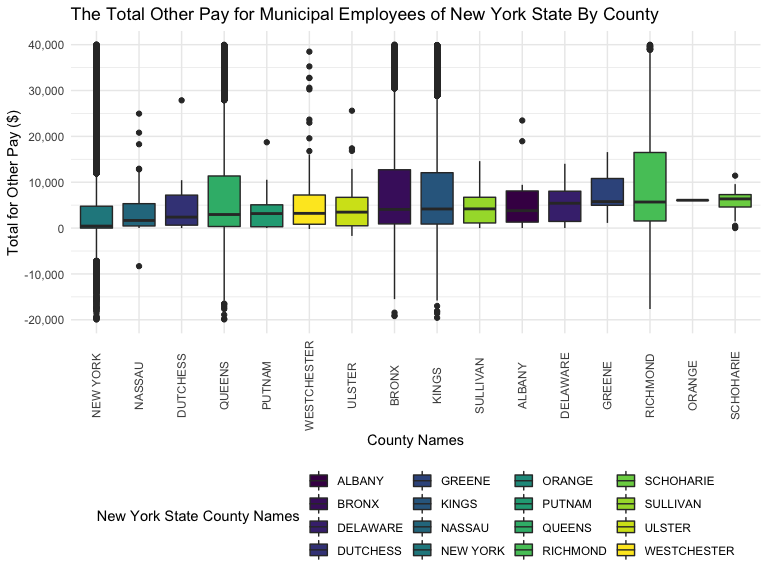
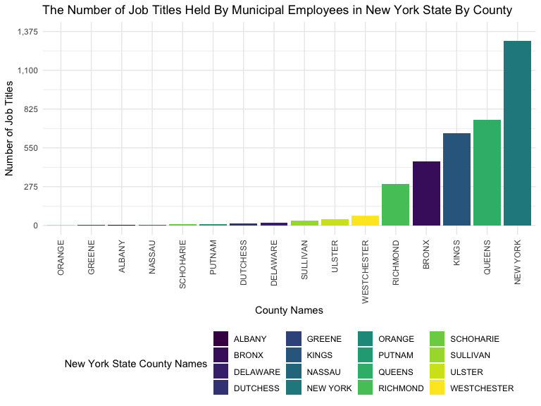
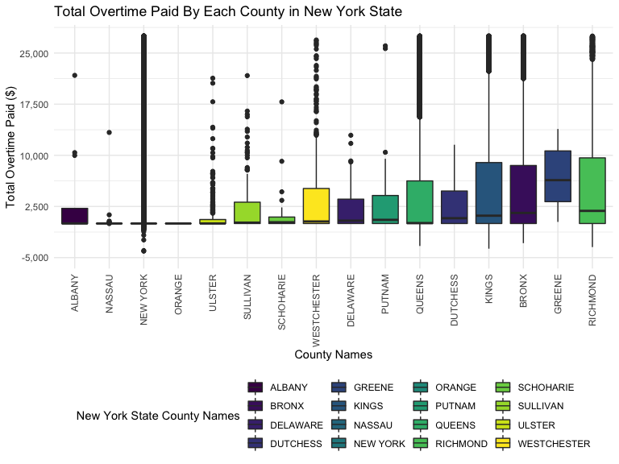
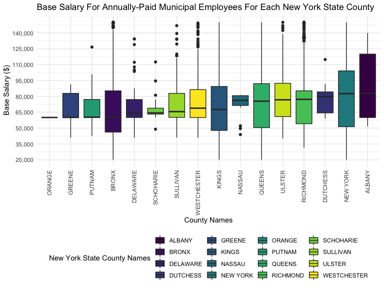
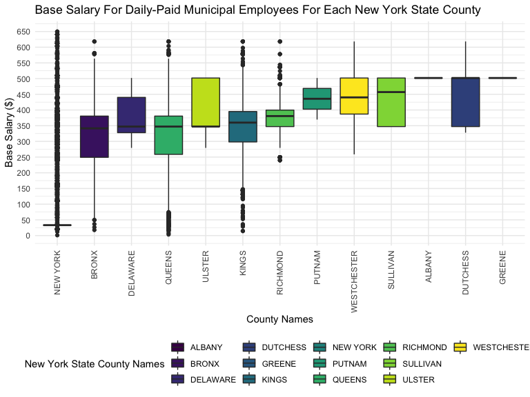
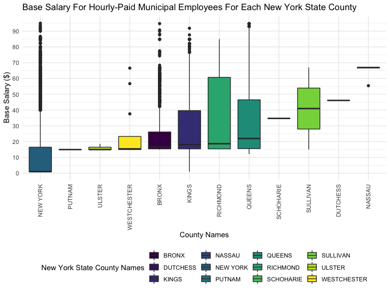

nys_salary_project
================
Nergui, Varvara, Justin

``` r
library(tidyverse)
```

    ## ── Attaching packages ─────────────────────────────────────── tidyverse 1.3.2 ──
    ## ✔ ggplot2 3.3.6      ✔ purrr   0.3.4 
    ## ✔ tibble  3.1.8      ✔ dplyr   1.0.10
    ## ✔ tidyr   1.2.0      ✔ stringr 1.4.1 
    ## ✔ readr   2.1.2      ✔ forcats 0.5.2 
    ## ── Conflicts ────────────────────────────────────────── tidyverse_conflicts() ──
    ## ✖ dplyr::filter() masks stats::filter()
    ## ✖ dplyr::lag()    masks stats::lag()

``` r
library(janitor)
```

    ## 
    ## Attaching package: 'janitor'
    ## 
    ## The following objects are masked from 'package:stats':
    ## 
    ##     chisq.test, fisher.test

``` r
library(viridis)
```

    ## Loading required package: viridisLite

``` r
knitr::opts_chunk$set(
    echo = TRUE,
    warning = FALSE,
    fig.width = 8, 
  fig.height = 6,
  out.width = "90%"
)
options(
  ggplot2.continuous.colour = "viridis",
  ggplot2.continuous.fill = "viridis"
)
scale_colour_discrete = scale_colour_viridis_d
scale_fill_discrete = scale_fill_viridis_d
theme_set(theme_minimal() + theme(legend.position = "bottom"))
```

``` r
 payroll_data = 
    read_csv("data/Citywide_Payroll_Data__Fiscal_Year_.csv") %>% 
    clean_names() %>%
    filter(fiscal_year == "2022",
           work_location_borough != "NA",
           work_location_borough != "OTHER",
           work_location_borough != "WASHINGTON DC",
           leave_status_as_of_june_30 != "ON SEPARATION LEAVE",
           leave_status_as_of_june_30 != "SEASONAL",
           title_description != "NA") %>%
       separate(agency_start_date, into = c("month", "day", "start_year"), convert = TRUE) %>% 
      mutate(leave_status = leave_status_as_of_june_30,
             pay_basis = recode(pay_basis, "per Annum" = "Annually"),
             pay_basis = recode(pay_basis, "per Day" = "Daily"),
             pay_basis = recode(pay_basis, "per Hour" = "Hourly"),
             county_name = work_location_borough,
             county_name = recode(county_name, "MANHATTAN" = "NEW YORK"),
             county_name = recode(county_name, "BROOKLYN" = "KINGS",
             job_title = title_description)) %>% 
    select(-payroll_number, -first_name, -last_name, -mid_init, -month, -day, -leave_status_as_of_june_30, -regular_hours, -ot_hours, -regular_gross_paid, -work_location_borough) %>% 
    mutate(county_name = as.factor(county_name),
           pay_basis = as.factor(pay_basis),
           leave_status = as.factor(leave_status),
           job_title = title_description) %>%
  select(-title_description)
```

    ## Rows: 5109775 Columns: 17
    ## ── Column specification ────────────────────────────────────────────────────────
    ## Delimiter: ","
    ## chr (9): Agency Name, Last Name, First Name, Mid Init, Agency Start Date, Wo...
    ## dbl (8): Fiscal Year, Payroll Number, Base Salary, Regular Hours, Regular Gr...
    ## 
    ## ℹ Use `spec()` to retrieve the full column specification for this data.
    ## ℹ Specify the column types or set `show_col_types = FALSE` to quiet this message.

``` r
head(payroll_data)
```

    ## # A tibble: 6 × 10
    ##   fiscal_year agency_n…¹ start…² base_…³ pay_b…⁴ total…⁵ total…⁶ leave…⁷ count…⁸
    ##         <dbl> <chr>        <int>   <dbl> <fct>     <dbl>   <dbl> <fct>   <fct>  
    ## 1        2022 DEPT OF E…    1988  128409 Annual…       0   8259. CEASED  NEW YO…
    ## 2        2022 DEPT OF E…    2015   97469 Annual…       0   1486. ACTIVE  NEW YO…
    ## 3        2022 DEPT OF E…    2000  169456 Annual…       0  16947. ACTIVE  NEW YO…
    ## 4        2022 DEPT OF E…    2000   92906 Annual…       0   4426. CEASED  NEW YO…
    ## 5        2022 DEPT OF E…    2007  100351 Annual…       0   4852. ACTIVE  NEW YO…
    ## 6        2022 DEPT OF E…    2022   69866 Annual…       0   2801. ACTIVE  NEW YO…
    ## # … with 1 more variable: job_title <chr>, and abbreviated variable names
    ## #   ¹​agency_name, ²​start_year, ³​base_salary, ⁴​pay_basis, ⁵​total_ot_paid,
    ## #   ⁶​total_other_pay, ⁷​leave_status, ⁸​county_name

\#Varvy’s visualizations \#Pie Chart for the percentages and numbers of
the different leave statuses

``` r
Total_ls = table(pull(payroll_data,leave_status))

Total_ls
```

    ## 
    ##   ACTIVE   CEASED ON LEAVE 
    ##   481781   102360    10093

``` r
labels = c("Active", "Ceased", "On Leave")

piepercent = round(100 * Total_ls / sum(Total_ls), 1)

par(xpd = TRUE) 
pie(Total_ls, labels = paste(labels, sep = " ", piepercent, "%"),
    main = "Percentages of Municipal Employees by Leave Status", col = viridis(length(Total_ls)))
legend("topright", c("Active", "Ceased", "On Leave"),cex = 0.9, fill = viridis(length(Total_ls)))
```


\#Bar Graph for number of employees by municipality separated by leave
status

``` r
Ls_bar = payroll_data %>%
  group_by(leave_status) %>%
  summarise(
    count = n())

ggplot(Ls_bar, aes(x = leave_status, y = count, fill = leave_status)) + geom_bar(position = "dodge", stat = "identity") + labs(title = "The Number of Employees by Municipality Separated  by Leave Status", x = "Leave Status", y = "Number of Employees") + scale_y_continuous(labels = scales::comma)
```


\#Varvara & Justin - Statistical Analysis(ANOVA and Tukey Test)

\#Performing the ANOVA tests to determine significant difference in the
means of total pay among municipal employees by county in 2022

Null Hypothesis(Ho) = The mean base salary is constant for all counties
H1 = The mean base salary is different for all municipalities

``` r
bs_model = payroll_data %>%
  mutate(county_name = as.factor(county_name)) %>%
  group_by(county_name) %>%
  summarise(bs_mean = base_salary)
```

    ## `summarise()` has grouped output by 'county_name'. You can override using the
    ## `.groups` argument.

``` r
res = lm(bs_mean ~ factor(county_name), data = bs_model)
res
```

    ## 
    ## Call:
    ## lm(formula = bs_mean ~ factor(county_name), data = bs_model)
    ## 
    ## Coefficients:
    ##                    (Intercept)        factor(county_name)BRONX  
    ##                         104555                          -46794  
    ##    factor(county_name)DELAWARE     factor(county_name)DUTCHESS  
    ##                         -37029                          -46796  
    ##      factor(county_name)GREENE        factor(county_name)KINGS  
    ##                         -44973                          -41916  
    ##      factor(county_name)NASSAU     factor(county_name)NEW YORK  
    ##                         -71164                          -61725  
    ##      factor(county_name)ORANGE       factor(county_name)PUTNAM  
    ##                         -44452                          -40565  
    ##      factor(county_name)QUEENS     factor(county_name)RICHMOND  
    ##                         -42864                          -43923  
    ##   factor(county_name)SCHOHARIE     factor(county_name)SULLIVAN  
    ##                         -35125                          -31242  
    ##      factor(county_name)ULSTER  factor(county_name)WESTCHESTER  
    ##                         -27363                          -33863

``` r
anova(res) %>% broom::tidy() %>% knitr::kable(caption = "One Way Anova Test for Mean Salary by County")
```

| term                |     df |        sumsq |       meansq | statistic | p.value |
|:--------------------|-------:|-------------:|-------------:|----------:|--------:|
| factor(county_name) |     15 | 3.805341e+13 | 2.536894e+12 |  1199.016 |       0 |
| Residuals           | 594218 | 1.257254e+15 | 2.115813e+09 |        NA |      NA |

One Way Anova Test for Mean Salary by County

\#Tukey test for Mean Salary by County

``` r
res1 = aov(bs_mean ~ factor(county_name), data = bs_model)
Tukey_bs = TukeyHSD(res1)
Tukey_bs
```

    ##   Tukey multiple comparisons of means
    ##     95% family-wise confidence level
    ## 
    ## Fit: aov(formula = bs_mean ~ factor(county_name), data = bs_model)
    ## 
    ## $`factor(county_name)`
    ##                                diff          lwr           upr     p adj
    ## BRONX-ALBANY          -46793.672635  -90512.1734  -3075.171912 0.0222448
    ## DELAWARE-ALBANY       -37028.785191  -84073.8941  10016.323741 0.3324215
    ## DUTCHESS-ALBANY       -46795.579199  -99123.4667   5532.308303 0.1432005
    ## GREENE-ALBANY         -44972.509532 -111258.7702  21313.751087 0.6052943
    ## KINGS-ALBANY          -41916.067279  -85629.6490   1797.514460 0.0771545
    ## NASSAU-ALBANY         -71164.422020 -121325.2335 -21003.610556 0.0001341
    ## NEW YORK-ALBANY       -61724.589860 -105433.0877 -18016.091985 0.0001499
    ## ORANGE-ALBANY         -44452.301533 -207992.1609 119087.557797 0.9999216
    ## PUTNAM-ALBANY         -40564.933675  -90581.7796   9451.912253 0.2812590
    ## QUEENS-ALBANY         -42864.041768  -86576.6770    848.593477 0.0615951
    ## RICHMOND-ALBANY       -43922.761054  -87668.6783   -176.843758 0.0478351
    ## SCHOHARIE-ALBANY      -35125.034981  -87724.9749  17474.904960 0.6329486
    ## SULLIVAN-ALBANY       -31241.821142  -77115.5638  14631.921470 0.5985696
    ## ULSTER-ALBANY         -27363.261353  -71913.6099  17187.087178 0.7627319
    ## WESTCHESTER-ALBANY    -33863.274624  -78097.0292  10370.479944 0.3822703
    ## DELAWARE-BRONX          9764.887443   -7664.8141  27194.588979 0.8674314
    ## DUTCHESS-BRONX            -1.906564  -28790.0991  28786.286008 1.0000000
    ## GREENE-BRONX            1821.163102  -48022.7991  51665.125305 1.0000000
    ## KINGS-BRONX             4877.605356    3682.0094   6073.201277 0.0000000
    ## NASSAU-BRONX          -24370.749386  -49001.2026    259.703877 0.0560434
    ## NEW YORK-BRONX        -14930.917225  -15923.3927 -13938.441725 0.0000000
    ## ORANGE-BRONX            2341.371101 -155252.5305 159935.272668 1.0000000
    ## PUTNAM-BRONX            6228.738959  -18107.1830  30564.660922 0.9999637
    ## QUEENS-BRONX            3929.630867    2769.1563   5090.105448 0.0000000
    ## RICHMOND-BRONX          2870.911581     807.5403   4934.282908 0.0002127
    ## SCHOHARIE-BRONX        11668.637654  -17611.1489  40948.424246 0.9932456
    ## SULLIVAN-BRONX         15551.851493    1589.3130  29514.390032 0.0129459
    ## ULSTER-BRONX           19430.411282   10753.6737  28107.148885 0.0000000
    ## WESTCHESTER-BRONX      12930.398011    6061.8272  19798.968775 0.0000000
    ## DUTCHESS-DELAWARE      -9766.794007  -43392.6026  23859.014541 0.9998199
    ## GREENE-DELAWARE        -7943.724341  -60729.6651  44842.216373 1.0000000
    ## KINGS-DELAWARE         -4887.282087  -22304.6418  12530.077603 0.9998829
    ## NASSAU-DELAWARE       -34135.636829  -64278.5331  -3992.740537 0.0101729
    ## NEW YORK-DELAWARE     -24695.804668  -42100.4011  -7291.208247 0.0001337
    ## ORANGE-DELAWARE        -7423.516342 -165972.4765 151125.443856 1.0000000
    ## PUTNAM-DELAWARE        -3536.148484  -33438.8585  26366.561540 1.0000000
    ## QUEENS-DELAWARE        -5835.256577  -23250.2406  11579.727495 0.9989983
    ## RICHMOND-DELAWARE      -6893.975863  -24392.3321  10604.380352 0.9940052
    ## SCHOHARIE-DELAWARE      1903.750211  -32143.8763  35951.376734 1.0000000
    ## SULLIVAN-DELAWARE       5786.964050  -16504.0084  28077.936469 0.9999564
    ## ULSTER-DELAWARE         9665.523839   -9756.6476  29087.695303 0.9460342
    ## WESTCHESTER-DELAWARE    3165.510568  -15519.0347  21850.055874 0.9999999
    ## GREENE-DUTCHESS         1823.069667  -55721.0097  59367.149058 1.0000000
    ## KINGS-DUTCHESS          4879.511920  -23901.2100  33660.233845 0.9999999
    ## NASSAU-DUTCHESS       -24368.842821  -62231.2217  13493.536037 0.6937833
    ## NEW YORK-DUTCHESS     -14929.010661  -43702.0104  13843.989053 0.9245775
    ## ORANGE-DUTCHESS         2343.277666 -157852.6596 162539.214930 1.0000000
    ## PUTNAM-DUTCHESS         6230.645524  -31440.7973  43902.088325 0.9999999
    ## QUEENS-DUTCHESS         3931.537431  -24847.7469  32710.821755 1.0000000
    ## RICHMOND-DUTCHESS       2872.818145  -25956.9929  31702.629212 1.0000000
    ## SCHOHARIE-DUTCHESS     11670.544218  -29368.5397  52709.628124 0.9998615
    ## SULLIVAN-DUTCHESS      15553.758057  -16412.6773  47520.193382 0.9553143
    ## ULSTER-DUTCHESS        19432.317846  -10604.0981  49468.733750 0.6855515
    ## WESTCHESTER-DUTCHESS   12932.304575  -16632.5017  42497.110837 0.9829191
    ## KINGS-GREENE            3056.442253  -46783.2055  52896.090036 1.0000000
    ## NASSAU-GREENE         -26191.912488  -81772.6670  29388.841999 0.9661308
    ## NEW YORK-GREENE       -16752.080328  -66587.2692  33083.108536 0.9989603
    ## ORANGE-GREENE            520.207999 -164762.5765 165802.992500 1.0000000
    ## PUTNAM-GREENE           4407.575857  -51043.2865  59858.438242 1.0000000
    ## QUEENS-GREENE           2108.467764  -47730.3499  51947.285394 1.0000000
    ## RICHMOND-GREENE         1049.748478  -48818.2627  50917.759695 1.0000000
    ## SCHOHARIE-GREENE        9847.474552  -47944.1074  67639.056502 0.9999999
    ## SULLIVAN-GREENE        13730.688390  -38014.0072  65475.384002 0.9999423
    ## ULSTER-GREENE          17609.248179  -32965.9119  68184.408257 0.9984440
    ## WESTCHESTER-GREENE     11109.234909  -39187.2690  61405.738821 0.9999948
    ## NASSAU-KINGS          -29248.354742  -53870.0759  -4626.633623 0.0048128
    ## NEW YORK-KINGS        -19808.522581  -20553.4592 -19063.585952 0.0000000
    ## ORANGE-KINGS           -2536.234255 -160128.7713 155056.302796 1.0000000
    ## PUTNAM-KINGS            1351.133603  -22975.9505  25678.217702 1.0000000
    ## QUEENS-KINGS            -947.974489   -1905.3794      9.430451 0.0556275
    ## RICHMOND-KINGS         -2006.693775   -3963.0742    -50.313394 0.0375474
    ## SCHOHARIE-KINGS         6791.032298  -22481.4091  36063.473704 0.9999900
    ## SULLIVAN-KINGS         10674.246137   -3272.8828  24621.375068 0.3827873
    ## ULSTER-KINGS           14552.805926    5900.8872  23204.724696 0.0000010
    ## WESTCHESTER-KINGS       8052.792655    1215.6012  14889.984133 0.0055358
    ## NEW YORK-NASSAU         9439.832160  -15172.8619  34052.526220 0.9954854
    ## ORANGE-NASSAU          26712.120487 -132789.0943 186213.335254 0.9999999
    ## PUTNAM-NASSAU          30599.488345   -3998.7312  65197.707939 0.1562546
    ## QUEENS-NASSAU          28300.380252    3680.3396  52920.420921 0.0081241
    ## RICHMOND-NASSAU        27241.660966    2562.5767  51920.745278 0.0146993
    ## SCHOHARIE-NASSAU       36039.387040   -2198.1025  74276.876551 0.0909144
    ## SULLIVAN-NASSAU        39922.600878   11642.7108  68202.490972 0.0001511
    ## ULSTER-NASSAU          43801.160667   17722.7122  69879.609178 0.0000010
    ## WESTCHESTER-NASSAU     37301.147397   11767.3078  62834.987014 0.0000647
    ## ORANGE-NEW YORK        17272.288326 -140318.8386 174863.415272 1.0000000
    ## PUTNAM-NEW YORK        21159.656185   -3158.2915  45477.603852 0.1767366
    ## QUEENS-NEW YORK        18860.548092   18173.3929  19547.703264 0.0000000
    ## RICHMOND-NEW YORK      17801.828806   15962.5403  19641.117312 0.0000000
    ## SCHOHARIE-NEW YORK     26599.554879   -2665.2941  55864.403826 0.1253369
    ## SULLIVAN-NEW YORK      30482.768718   16551.5820  44413.955438 0.0000000
    ## ULSTER-NEW YORK        34361.328507   25735.1326  42987.524448 0.0000000
    ## WESTCHESTER-NEW YORK   27861.315236   21056.7032  34665.927298 0.0000000
    ## PUTNAM-ORANGE           3887.367858 -155568.6304 163343.366121 1.0000000
    ## QUEENS-ORANGE           1588.259765 -156004.0147 159180.534277 1.0000000
    ## RICHMOND-ORANGE          529.540479 -157071.9690 158131.049944 1.0000000
    ## SCHOHARIE-ORANGE        9327.266553 -150957.7427 169612.275793 1.0000000
    ## SULLIVAN-ORANGE        13210.480392 -144994.8633 171415.824065 1.0000000
    ## ULSTER-ORANGE          17089.040181 -140737.6498 174915.730128 1.0000000
    ## WESTCHESTER-ORANGE     10589.026910 -147148.5892 168326.643060 1.0000000
    ## QUEENS-PUTNAM          -2299.108093  -26624.4914  22026.275201 1.0000000
    ## RICHMOND-PUTNAM        -3357.827379  -27742.9678  21027.313022 1.0000000
    ## SCHOHARIE-PUTNAM        5439.898695  -32608.5372  43488.334589 1.0000000
    ## SULLIVAN-PUTNAM         9323.112533  -18700.6284  37346.853426 0.9990780
    ## ULSTER-PUTNAM          13201.672323  -12598.7801  39002.124772 0.9324023
    ## WESTCHESTER-PUTNAM      6701.659052  -18548.1892  31951.507279 0.9999421
    ## RICHMOND-QUEENS        -1058.719286   -2993.8358    876.397208 0.8878165
    ## SCHOHARIE-QUEENS        7739.006787  -21532.0212  37010.034742 0.9999449
    ## SULLIVAN-QUEENS        11622.220626   -2321.9415  25566.382740 0.2377715
    ## ULSTER-QUEENS          15500.780415    6853.6450  24147.915782 0.0000001
    ## WESTCHESTER-QUEENS      9000.767144    2169.6297  15831.904601 0.0007032
    ## SCHOHARIE-RICHMOND      8797.726073  -20522.9812  38118.433389 0.9997313
    ## SULLIVAN-RICHMOND      12680.939912   -1367.2079  26729.087727 0.1327340
    ## ULSTER-RICHMOND        16559.499701    7745.6611  25373.338254 0.0000000
    ## WESTCHESTER-RICHMOND   10059.486430    3018.5178  17100.455038 0.0001131
    ## SULLIVAN-SCHOHARIE      3883.213839  -28526.6436  36293.071270 1.0000000
    ## ULSTER-SCHOHARIE        7761.773628  -22746.1295  38269.676730 0.9999665
    ## WESTCHESTER-SCHOHARIE   1261.760357  -28781.9352  31305.455879 1.0000000
    ## ULSTER-SULLIVAN         3878.559789  -12503.7090  20260.828595 0.9999869
    ## WESTCHESTER-SULLIVAN   -2621.453482  -18122.1057  12879.198767 0.9999999
    ## WESTCHESTER-ULSTER     -6500.013271  -17481.9764   4481.949811 0.8099179

``` r
Tukey_bs %>%broom::tidy() %>% knitr::kable(caption = "Tukey Test for Mean Salary by County")
```

| term                | contrast              | null.value |      estimate |     conf.low |     conf.high | adj.p.value |
|:--------------------|:----------------------|-----------:|--------------:|-------------:|--------------:|------------:|
| factor(county_name) | BRONX-ALBANY          |          0 | -46793.672635 |  -90512.1734 |  -3075.171912 |   0.0222448 |
| factor(county_name) | DELAWARE-ALBANY       |          0 | -37028.785191 |  -84073.8941 |  10016.323741 |   0.3324215 |
| factor(county_name) | DUTCHESS-ALBANY       |          0 | -46795.579199 |  -99123.4667 |   5532.308303 |   0.1432005 |
| factor(county_name) | GREENE-ALBANY         |          0 | -44972.509532 | -111258.7702 |  21313.751087 |   0.6052943 |
| factor(county_name) | KINGS-ALBANY          |          0 | -41916.067279 |  -85629.6490 |   1797.514460 |   0.0771545 |
| factor(county_name) | NASSAU-ALBANY         |          0 | -71164.422020 | -121325.2335 | -21003.610556 |   0.0001341 |
| factor(county_name) | NEW YORK-ALBANY       |          0 | -61724.589860 | -105433.0877 | -18016.091985 |   0.0001499 |
| factor(county_name) | ORANGE-ALBANY         |          0 | -44452.301533 | -207992.1609 | 119087.557797 |   0.9999216 |
| factor(county_name) | PUTNAM-ALBANY         |          0 | -40564.933675 |  -90581.7796 |   9451.912253 |   0.2812590 |
| factor(county_name) | QUEENS-ALBANY         |          0 | -42864.041768 |  -86576.6770 |    848.593477 |   0.0615951 |
| factor(county_name) | RICHMOND-ALBANY       |          0 | -43922.761054 |  -87668.6783 |   -176.843758 |   0.0478351 |
| factor(county_name) | SCHOHARIE-ALBANY      |          0 | -35125.034981 |  -87724.9749 |  17474.904959 |   0.6329486 |
| factor(county_name) | SULLIVAN-ALBANY       |          0 | -31241.821142 |  -77115.5638 |  14631.921470 |   0.5985696 |
| factor(county_name) | ULSTER-ALBANY         |          0 | -27363.261353 |  -71913.6099 |  17187.087179 |   0.7627319 |
| factor(county_name) | WESTCHESTER-ALBANY    |          0 | -33863.274624 |  -78097.0292 |  10370.479944 |   0.3822703 |
| factor(county_name) | DELAWARE-BRONX        |          0 |   9764.887443 |   -7664.8141 |  27194.588978 |   0.8674314 |
| factor(county_name) | DUTCHESS-BRONX        |          0 |     -1.906564 |  -28790.0991 |  28786.286008 |   1.0000000 |
| factor(county_name) | GREENE-BRONX          |          0 |   1821.163102 |  -48022.7991 |  51665.125305 |   1.0000000 |
| factor(county_name) | KINGS-BRONX           |          0 |   4877.605356 |    3682.0094 |   6073.201276 |   0.0000000 |
| factor(county_name) | NASSAU-BRONX          |          0 | -24370.749386 |  -49001.2026 |    259.703877 |   0.0560434 |
| factor(county_name) | NEW YORK-BRONX        |          0 | -14930.917225 |  -15923.3927 | -13938.441726 |   0.0000000 |
| factor(county_name) | ORANGE-BRONX          |          0 |   2341.371101 | -155252.5305 | 159935.272668 |   1.0000000 |
| factor(county_name) | PUTNAM-BRONX          |          0 |   6228.738959 |  -18107.1830 |  30564.660922 |   0.9999637 |
| factor(county_name) | QUEENS-BRONX          |          0 |   3929.630867 |    2769.1563 |   5090.105448 |   0.0000000 |
| factor(county_name) | RICHMOND-BRONX        |          0 |   2870.911581 |     807.5403 |   4934.282908 |   0.0002127 |
| factor(county_name) | SCHOHARIE-BRONX       |          0 |  11668.637654 |  -17611.1489 |  40948.424246 |   0.9932456 |
| factor(county_name) | SULLIVAN-BRONX        |          0 |  15551.851493 |    1589.3130 |  29514.390031 |   0.0129459 |
| factor(county_name) | ULSTER-BRONX          |          0 |  19430.411282 |   10753.6737 |  28107.148885 |   0.0000000 |
| factor(county_name) | WESTCHESTER-BRONX     |          0 |  12930.398011 |    6061.8272 |  19798.968775 |   0.0000000 |
| factor(county_name) | DUTCHESS-DELAWARE     |          0 |  -9766.794007 |  -43392.6026 |  23859.014541 |   0.9998199 |
| factor(county_name) | GREENE-DELAWARE       |          0 |  -7943.724341 |  -60729.6651 |  44842.216373 |   1.0000000 |
| factor(county_name) | KINGS-DELAWARE        |          0 |  -4887.282087 |  -22304.6418 |  12530.077603 |   0.9998829 |
| factor(county_name) | NASSAU-DELAWARE       |          0 | -34135.636829 |  -64278.5331 |  -3992.740537 |   0.0101729 |
| factor(county_name) | NEW YORK-DELAWARE     |          0 | -24695.804668 |  -42100.4011 |  -7291.208247 |   0.0001337 |
| factor(county_name) | ORANGE-DELAWARE       |          0 |  -7423.516342 | -165972.4765 | 151125.443856 |   1.0000000 |
| factor(county_name) | PUTNAM-DELAWARE       |          0 |  -3536.148484 |  -33438.8585 |  26366.561540 |   1.0000000 |
| factor(county_name) | QUEENS-DELAWARE       |          0 |  -5835.256576 |  -23250.2406 |  11579.727495 |   0.9989983 |
| factor(county_name) | RICHMOND-DELAWARE     |          0 |  -6893.975863 |  -24392.3321 |  10604.380352 |   0.9940052 |
| factor(county_name) | SCHOHARIE-DELAWARE    |          0 |   1903.750211 |  -32143.8763 |  35951.376734 |   1.0000000 |
| factor(county_name) | SULLIVAN-DELAWARE     |          0 |   5786.964050 |  -16504.0084 |  28077.936469 |   0.9999564 |
| factor(county_name) | ULSTER-DELAWARE       |          0 |   9665.523839 |   -9756.6476 |  29087.695303 |   0.9460342 |
| factor(county_name) | WESTCHESTER-DELAWARE  |          0 |   3165.510568 |  -15519.0347 |  21850.055874 |   0.9999999 |
| factor(county_name) | GREENE-DUTCHESS       |          0 |   1823.069667 |  -55721.0097 |  59367.149058 |   1.0000000 |
| factor(county_name) | KINGS-DUTCHESS        |          0 |   4879.511920 |  -23901.2100 |  33660.233845 |   0.9999999 |
| factor(county_name) | NASSAU-DUTCHESS       |          0 | -24368.842821 |  -62231.2217 |  13493.536037 |   0.6937833 |
| factor(county_name) | NEW YORK-DUTCHESS     |          0 | -14929.010661 |  -43702.0104 |  13843.989053 |   0.9245775 |
| factor(county_name) | ORANGE-DUTCHESS       |          0 |   2343.277665 | -157852.6596 | 162539.214930 |   1.0000000 |
| factor(county_name) | PUTNAM-DUTCHESS       |          0 |   6230.645524 |  -31440.7973 |  43902.088325 |   0.9999999 |
| factor(county_name) | QUEENS-DUTCHESS       |          0 |   3931.537431 |  -24847.7469 |  32710.821755 |   1.0000000 |
| factor(county_name) | RICHMOND-DUTCHESS     |          0 |   2872.818145 |  -25956.9929 |  31702.629212 |   1.0000000 |
| factor(county_name) | SCHOHARIE-DUTCHESS    |          0 |  11670.544218 |  -29368.5397 |  52709.628124 |   0.9998615 |
| factor(county_name) | SULLIVAN-DUTCHESS     |          0 |  15553.758057 |  -16412.6773 |  47520.193382 |   0.9553143 |
| factor(county_name) | ULSTER-DUTCHESS       |          0 |  19432.317846 |  -10604.0981 |  49468.733750 |   0.6855515 |
| factor(county_name) | WESTCHESTER-DUTCHESS  |          0 |  12932.304575 |  -16632.5017 |  42497.110837 |   0.9829191 |
| factor(county_name) | KINGS-GREENE          |          0 |   3056.442253 |  -46783.2055 |  52896.090036 |   1.0000000 |
| factor(county_name) | NASSAU-GREENE         |          0 | -26191.912488 |  -81772.6670 |  29388.841999 |   0.9661308 |
| factor(county_name) | NEW YORK-GREENE       |          0 | -16752.080328 |  -66587.2692 |  33083.108536 |   0.9989603 |
| factor(county_name) | ORANGE-GREENE         |          0 |    520.207999 | -164762.5765 | 165802.992500 |   1.0000000 |
| factor(county_name) | PUTNAM-GREENE         |          0 |   4407.575857 |  -51043.2865 |  59858.438242 |   1.0000000 |
| factor(county_name) | QUEENS-GREENE         |          0 |   2108.467764 |  -47730.3499 |  51947.285394 |   1.0000000 |
| factor(county_name) | RICHMOND-GREENE       |          0 |   1049.748478 |  -48818.2627 |  50917.759694 |   1.0000000 |
| factor(county_name) | SCHOHARIE-GREENE      |          0 |   9847.474551 |  -47944.1074 |  67639.056502 |   0.9999999 |
| factor(county_name) | SULLIVAN-GREENE       |          0 |  13730.688390 |  -38014.0072 |  65475.384002 |   0.9999423 |
| factor(county_name) | ULSTER-GREENE         |          0 |  17609.248179 |  -32965.9119 |  68184.408257 |   0.9984440 |
| factor(county_name) | WESTCHESTER-GREENE    |          0 |  11109.234909 |  -39187.2690 |  61405.738821 |   0.9999948 |
| factor(county_name) | NASSAU-KINGS          |          0 | -29248.354741 |  -53870.0759 |  -4626.633622 |   0.0048128 |
| factor(county_name) | NEW YORK-KINGS        |          0 | -19808.522581 |  -20553.4592 | -19063.585952 |   0.0000000 |
| factor(county_name) | ORANGE-KINGS          |          0 |  -2536.234255 | -160128.7713 | 155056.302796 |   1.0000000 |
| factor(county_name) | PUTNAM-KINGS          |          0 |   1351.133603 |  -22975.9505 |  25678.217702 |   1.0000000 |
| factor(county_name) | QUEENS-KINGS          |          0 |   -947.974489 |   -1905.3794 |      9.430451 |   0.0556275 |
| factor(county_name) | RICHMOND-KINGS        |          0 |  -2006.693775 |   -3963.0742 |    -50.313394 |   0.0375474 |
| factor(county_name) | SCHOHARIE-KINGS       |          0 |   6791.032298 |  -22481.4091 |  36063.473704 |   0.9999900 |
| factor(county_name) | SULLIVAN-KINGS        |          0 |  10674.246137 |   -3272.8828 |  24621.375068 |   0.3827873 |
| factor(county_name) | ULSTER-KINGS          |          0 |  14552.805926 |    5900.8872 |  23204.724696 |   0.0000010 |
| factor(county_name) | WESTCHESTER-KINGS     |          0 |   8052.792655 |    1215.6012 |  14889.984133 |   0.0055358 |
| factor(county_name) | NEW YORK-NASSAU       |          0 |   9439.832160 |  -15172.8619 |  34052.526220 |   0.9954854 |
| factor(county_name) | ORANGE-NASSAU         |          0 |  26712.120487 | -132789.0943 | 186213.335254 |   0.9999999 |
| factor(county_name) | PUTNAM-NASSAU         |          0 |  30599.488345 |   -3998.7312 |  65197.707939 |   0.1562546 |
| factor(county_name) | QUEENS-NASSAU         |          0 |  28300.380252 |    3680.3396 |  52920.420921 |   0.0081241 |
| factor(county_name) | RICHMOND-NASSAU       |          0 |  27241.660966 |    2562.5767 |  51920.745278 |   0.0146993 |
| factor(county_name) | SCHOHARIE-NASSAU      |          0 |  36039.387040 |   -2198.1025 |  74276.876551 |   0.0909144 |
| factor(county_name) | SULLIVAN-NASSAU       |          0 |  39922.600878 |   11642.7108 |  68202.490972 |   0.0001511 |
| factor(county_name) | ULSTER-NASSAU         |          0 |  43801.160668 |   17722.7122 |  69879.609178 |   0.0000010 |
| factor(county_name) | WESTCHESTER-NASSAU    |          0 |  37301.147396 |   11767.3078 |  62834.987014 |   0.0000647 |
| factor(county_name) | ORANGE-NEW YORK       |          0 |  17272.288326 | -140318.8386 | 174863.415272 |   1.0000000 |
| factor(county_name) | PUTNAM-NEW YORK       |          0 |  21159.656184 |   -3158.2915 |  45477.603852 |   0.1767366 |
| factor(county_name) | QUEENS-NEW YORK       |          0 |  18860.548092 |   18173.3929 |  19547.703264 |   0.0000000 |
| factor(county_name) | RICHMOND-NEW YORK     |          0 |  17801.828806 |   15962.5403 |  19641.117312 |   0.0000000 |
| factor(county_name) | SCHOHARIE-NEW YORK    |          0 |  26599.554879 |   -2665.2941 |  55864.403826 |   0.1253369 |
| factor(county_name) | SULLIVAN-NEW YORK     |          0 |  30482.768718 |   16551.5820 |  44413.955438 |   0.0000000 |
| factor(county_name) | ULSTER-NEW YORK       |          0 |  34361.328507 |   25735.1326 |  42987.524448 |   0.0000000 |
| factor(county_name) | WESTCHESTER-NEW YORK  |          0 |  27861.315236 |   21056.7032 |  34665.927298 |   0.0000000 |
| factor(county_name) | PUTNAM-ORANGE         |          0 |   3887.367858 | -155568.6304 | 163343.366121 |   1.0000000 |
| factor(county_name) | QUEENS-ORANGE         |          0 |   1588.259765 | -156004.0147 | 159180.534277 |   1.0000000 |
| factor(county_name) | RICHMOND-ORANGE       |          0 |    529.540479 | -157071.9690 | 158131.049944 |   1.0000000 |
| factor(county_name) | SCHOHARIE-ORANGE      |          0 |   9327.266553 | -150957.7427 | 169612.275793 |   1.0000000 |
| factor(county_name) | SULLIVAN-ORANGE       |          0 |  13210.480392 | -144994.8633 | 171415.824065 |   1.0000000 |
| factor(county_name) | ULSTER-ORANGE         |          0 |  17089.040181 | -140737.6498 | 174915.730128 |   1.0000000 |
| factor(county_name) | WESTCHESTER-ORANGE    |          0 |  10589.026910 | -147148.5892 | 168326.643060 |   1.0000000 |
| factor(county_name) | QUEENS-PUTNAM         |          0 |  -2299.108093 |  -26624.4914 |  22026.275201 |   1.0000000 |
| factor(county_name) | RICHMOND-PUTNAM       |          0 |  -3357.827379 |  -27742.9678 |  21027.313022 |   1.0000000 |
| factor(county_name) | SCHOHARIE-PUTNAM      |          0 |   5439.898695 |  -32608.5372 |  43488.334589 |   1.0000000 |
| factor(county_name) | SULLIVAN-PUTNAM       |          0 |   9323.112533 |  -18700.6284 |  37346.853426 |   0.9990780 |
| factor(county_name) | ULSTER-PUTNAM         |          0 |  13201.672323 |  -12598.7801 |  39002.124772 |   0.9324023 |
| factor(county_name) | WESTCHESTER-PUTNAM    |          0 |   6701.659052 |  -18548.1892 |  31951.507279 |   0.9999421 |
| factor(county_name) | RICHMOND-QUEENS       |          0 |  -1058.719286 |   -2993.8358 |    876.397209 |   0.8878165 |
| factor(county_name) | SCHOHARIE-QUEENS      |          0 |   7739.006787 |  -21532.0212 |  37010.034742 |   0.9999449 |
| factor(county_name) | SULLIVAN-QUEENS       |          0 |  11622.220626 |   -2321.9415 |  25566.382740 |   0.2377715 |
| factor(county_name) | ULSTER-QUEENS         |          0 |  15500.780415 |    6853.6450 |  24147.915782 |   0.0000001 |
| factor(county_name) | WESTCHESTER-QUEENS    |          0 |   9000.767144 |    2169.6297 |  15831.904601 |   0.0007032 |
| factor(county_name) | SCHOHARIE-RICHMOND    |          0 |   8797.726073 |  -20522.9812 |  38118.433389 |   0.9997313 |
| factor(county_name) | SULLIVAN-RICHMOND     |          0 |  12680.939912 |   -1367.2079 |  26729.087727 |   0.1327340 |
| factor(county_name) | ULSTER-RICHMOND       |          0 |  16559.499701 |    7745.6611 |  25373.338254 |   0.0000000 |
| factor(county_name) | WESTCHESTER-RICHMOND  |          0 |  10059.486430 |    3018.5178 |  17100.455038 |   0.0001131 |
| factor(county_name) | SULLIVAN-SCHOHARIE    |          0 |   3883.213839 |  -28526.6436 |  36293.071270 |   1.0000000 |
| factor(county_name) | ULSTER-SCHOHARIE      |          0 |   7761.773628 |  -22746.1295 |  38269.676730 |   0.9999665 |
| factor(county_name) | WESTCHESTER-SCHOHARIE |          0 |   1261.760357 |  -28781.9352 |  31305.455879 |   1.0000000 |
| factor(county_name) | ULSTER-SULLIVAN       |          0 |   3878.559789 |  -12503.7090 |  20260.828595 |   0.9999869 |
| factor(county_name) | WESTCHESTER-SULLIVAN  |          0 |  -2621.453482 |  -18122.1057 |  12879.198767 |   0.9999999 |
| factor(county_name) | WESTCHESTER-ULSTER    |          0 |  -6500.013271 |  -17481.9764 |   4481.949811 |   0.8099179 |

Tukey Test for Mean Salary by County

# Justin’s Visualizations

## First Plot - Mean Base Salary By New York Counties

``` r
mean_base_salary_plot =
  payroll_data %>%
  group_by(county_name) %>%
  summarize(
      mean_base_salary = mean(base_salary, na.rm = TRUE)) %>%
        ggplot(aes(x = reorder(county_name, mean_base_salary), y = mean_base_salary, fill = county_name)) +
  geom_bar(position = "dodge", stat = "identity") +
  scale_y_continuous(
      labels = scales::comma) +
  labs(
    x = "County Names",
    y = "Mean Base Salary",
    title = "The Average Base Salary for Municipal Employees of New York State By County",
    fill = "New York State County Names"
  ) + 
  theme(axis.text.x = element_text(angle = 80, vjust = 0.5, hjust = 0.50)) 

mean_base_salary_plot
```


## Second Plot - Total Other Pay by New York Counties

``` r
median_tibble =
  payroll_data %>%
  group_by(county_name) %>%
  summarise(median_total_other_pay = median(total_other_pay))
median_other_pay_plot =
  payroll_data %>%
  left_join(median_tibble, by = "county_name") %>%
        ggplot(aes(x = reorder(county_name, median_total_other_pay), y = total_other_pay, fill = county_name)) +
  geom_boxplot() +
    scale_y_continuous(
      labels = scales::comma,
    limits = c(-20000, 40000),
    breaks = seq(-20000, 40000, by = 10000)) +
  labs(
    x = "County Names",
    y = "Median Total Other Types of Pay",
    title = "The Median Total Other Pay for Municipal Employees of New York State By County",
    fill = "New York State County Names"
  ) + 
  theme(axis.text.x = element_text(angle = 90, vjust = 0.5, hjust = 0.5)) 

median_other_pay_plot
```



``` r
#Fix reordering of boxplots
```

## Third Plot - Total Number of Job Titles by New York Counties

``` r
number_job_titles_plot =
  payroll_data %>%
  group_by(county_name, job_title) %>%
  summarise(count = n()) %>%
  ungroup() %>% 
  group_by(county_name) %>%
  summarise(count = n()) %>%
        ggplot(aes(x = reorder(county_name, count), y = count, fill = county_name)) +
  geom_bar(position = "dodge", stat = "identity") +
  scale_y_continuous(
      labels = scales::comma,
    limits = c(0, 1500),
    breaks = seq(0, 1500, by = 250)) +
  labs(
    x = "County Names",
    y = "Number of Job Titles",
    title = "The Number of Job Titles Held By Municipal Employees of New York State By County",
    fill = "New York State County Names"
  ) + 
  theme(axis.text.x = element_text(angle = 90, vjust = 0.5, hjust = 1)) 
```

    ## `summarise()` has grouped output by 'county_name'. You can override using the
    ## `.groups` argument.

``` r
number_job_titles_plot
```



# Nergui’s Visualization

# First boxplot for overtime pay by county

``` r
overtime_tibble = payroll_data %>% 
    group_by(county_name) %>% 
    summarise(median_total_ot_paid = median(total_ot_paid))
    
median_ot_paid_plot = 
    payroll_data |> 
    left_join(overtime_tibble, by = "county_name") |> 
    ggplot(aes(x = reorder(county_name, median_total_ot_paid ), y = total_ot_paid, fill = county_name)) +
    geom_boxplot() +
     scale_y_continuous(
      labels = scales::comma,
    limits = c(-5000, 32500),
    breaks = seq(-5000, 32500, by = 5000)) +
    labs(
    x = "County Names",
    y = "Total Overtime Paid",
    title = "Total Overtime Paid By Each County",
    fill = "New York State County Names"
  ) + theme(axis.text.x = element_text(angle = 90, vjust = 0.5, hjust = 1)) 


median_ot_paid_plot
```



# Second Boxplot for Median base salary by pay basis by county (Annually)

``` r
pay_basis_tibble = 
    payroll_data %>%
    filter(pay_basis == "Annually") |> 
    group_by(county_name) %>% 
    summarise(median_base_salary = median(base_salary))

Median_base_salary_plot_annually =
    payroll_data %>%
    left_join(pay_basis_tibble, by = "county_name") %>%
    ggplot(aes(x = reorder(county_name, median_base_salary), y = base_salary, fill = county_name)) +
    geom_boxplot() +
    scale_y_continuous(
      labels = scales::comma,
    limits = c(20000, 150000),
    breaks = seq(20000, 150000, by = 10000)) +
    labs(
    x = "County Names",
    y = " Base Salary",
    title = "Annual Median Base Salary For Each County", 
    fill = "New York State County Names"
  ) + theme(axis.text.x = element_text(angle = 90, vjust = 0.5, hjust = 1)) 

Median_base_salary_plot_annually
```



# Daily

``` r
pay_basis_daily_tibble = 
    payroll_data %>%
    filter(pay_basis == "Daily") |> 
    group_by(county_name) |> 
    summarise(median_base_salary_daily = median(base_salary))

Median_base_salary_plot_daily =
    payroll_data %>%
    left_join(pay_basis_daily_tibble,  by = "county_name") %>%
    ggplot(aes(x = reorder(county_name, median_base_salary_daily) , y = base_salary, fill = county_name)) +
    geom_boxplot() +
    scale_y_continuous(
      labels = scales::comma,
    limits = c(0,625),
    breaks = seq(0, 625, by = 50)) +
    labs(
    x = "County Names",
    y = " Base Salary",
    title = "Daily Median Base Salary For Each County", 
    fill = "New York State County Names"
  ) + theme(axis.text.x = element_text(angle = 90, vjust = 0.5, hjust = 1)) 

Median_base_salary_plot_daily
```



# Hourly

``` r
pay_basis_hourly_tibble= 
    payroll_data %>%
    filter(pay_basis == "Hourly") |> 
    group_by(county_name) %>%
    summarise(median_base_salary_hourly = median(base_salary))

Median_base_salary_plot_hourly =
    payroll_data %>%
    left_join(pay_basis_hourly_tibble,  by = "county_name") %>%
    ggplot(aes(x = reorder(county_name, median_base_salary_hourly), y = base_salary, fill = county_name)) +
    geom_boxplot() +
    scale_y_continuous(
      labels = scales::comma,
    limits = c(0,95),
    breaks = seq(0,95, by = 10)) +
    labs(
    x = "County Names",
    y = " Base Salary",
    title = "Hourly Median Base Salary For Each County",
     fill = "New York State County Names"
  ) + theme(axis.text.x = element_text(angle = 90, vjust = 0.5, hjust = 1)) 

Median_base_salary_plot_hourly
```



# Prorated

``` r
pay_basis_prorated_tibble = 
    payroll_data %>%
    filter(pay_basis == "Prorated Annual") |> 
    group_by(county_name) %>%
    summarise(median_base_salary_prorated = median(base_salary))  
    
Median_base_salary_plot_prorated =
    payroll_data %>%
    left_join(pay_basis_prorated_tibble,  by = "county_name") %>%   
    ggplot(aes(x = reorder(county_name, median_base_salary_prorated), y = base_salary, fill = county_name)) +
    geom_boxplot() +
    scale_y_continuous(
      labels = scales::comma,
    limits = c(5000,85000),
    breaks = seq(5000, 85000, by = 10000)) +
    labs(
    x = "County Names",
    y = " Base Salary",
    title = "Prorated Annual Median Base Salary For Each County",
    fill = "New York State County Names"
  ) + theme(axis.text.x = element_text(angle = 90, vjust = 0.5, hjust = 1))


Median_base_salary_plot_prorated
```


# Plot for Top 10 Job Titles Throughout the New York State Counties

``` r
job_frequency =
payroll_data %>%
    group_by(county_name, job_title) %>%
    summarise(job_frequency = n()) %>%
    arrange(desc(job_frequency)) %>%
    ungroup()
```

    ## `summarise()` has grouped output by 'county_name'. You can override using the
    ## `.groups` argument.

``` r
job_frequency_data = 
    job_frequency %>%
    top_n(job_frequency, n = 10) %>%
    mutate(
     job_title = recode(job_title, "TEACHER- PER SESSION" = "TEACHER PER SESSION"),
     job_title = recode(job_title, "ANNUAL ED PARA" = "EDUCATION PARAPROFESSIONAL"),
     job_title = recode(job_title, "TEACHER SPECIAL EDUCATION" = "SPECIAL EDUCATION TEACHER"),
     job_title = recode(job_title, "TEACHER-GENERAL ED" = "GENERAL EDUCATION TEACHER"),
     job_title = recode(job_title, "SUBSTITUTE ED PARA" = "SUBSTITUTE EDUCATION PARAPROFESSIONAL"),
     job_title = recode(job_title, "F/T SCHOOL AIDE" = "SCHOOL AIDE"))
    
job_frequency_plot =
    job_frequency_data %>%
    ggplot(aes(x = reorder(job_title, job_frequency), y = job_frequency, fill = county_name)) +
  geom_bar(position = "dodge", stat = "identity") + 
    scale_y_continuous(
      labels = scales::comma,
    limits = c(0, 120000),
    breaks = seq(0, 120000, by = 10000)) +
  labs(
    x = "Top 10 Job Titles",
    y = "Frequency of Job Titles",
    title = "The Top 10 Job Titles Held By Municipal Employees Throughout the Counties in New York State",
    fill = "New York State County Names"
  ) +
  theme(axis.text.x = element_text(angle = 90, vjust = 0.5, hjust = 1)) 

job_frequency_plot
```


