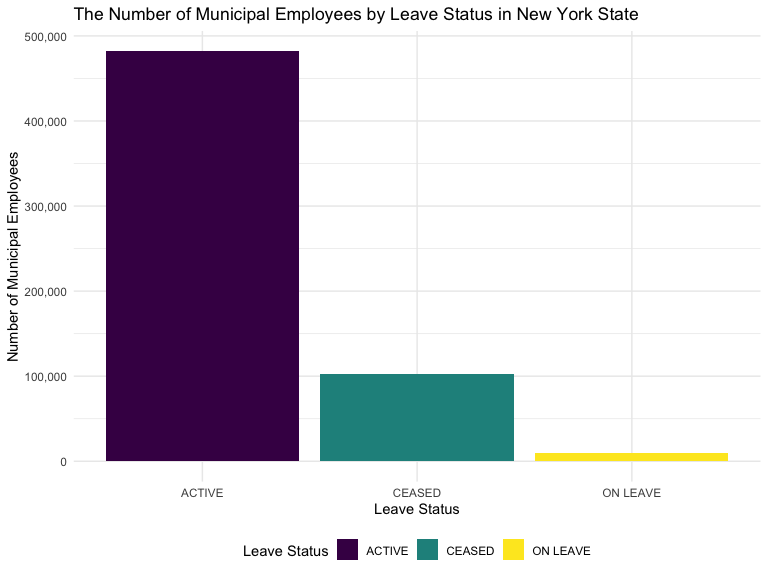

nys_salary_project
================
Nergui, Varvara, Justin

``` r
library(tidyverse)
```

    ## ── Attaching packages ─────────────────────────────────────── tidyverse 1.3.2 ──
    ## ✔ ggplot2 3.3.6      ✔ purrr   0.3.4 
    ## ✔ tibble  3.1.8      ✔ dplyr   1.0.10
    ## ✔ tidyr   1.2.0      ✔ stringr 1.4.1 
    ## ✔ readr   2.1.2      ✔ forcats 0.5.2 
    ## ── Conflicts ────────────────────────────────────────── tidyverse_conflicts() ──
    ## ✖ dplyr::filter() masks stats::filter()
    ## ✖ dplyr::lag()    masks stats::lag()

``` r
library(janitor)
```

    ## 
    ## Attaching package: 'janitor'
    ## 
    ## The following objects are masked from 'package:stats':
    ## 
    ##     chisq.test, fisher.test

``` r
library(viridis)
```

    ## Loading required package: viridisLite

``` r
knitr::opts_chunk$set(
    echo = TRUE,
    warning = FALSE,
    fig.width = 8, 
  fig.height = 6,
  out.width = "90%"
)
options(
  ggplot2.continuous.colour = "viridis",
  ggplot2.continuous.fill = "viridis"
)
scale_colour_discrete = scale_colour_viridis_d
scale_fill_discrete = scale_fill_viridis_d
theme_set(theme_minimal() + theme(legend.position = "bottom"))
```

``` r
 payroll_data = 
    read_csv("data/Citywide_Payroll_Data__Fiscal_Year_.csv") %>% 
    clean_names() %>%
    filter(fiscal_year == "2022",
           work_location_borough != "NA",
           work_location_borough != "OTHER", 
           leave_status_as_of_june_30 != "ON SEPARATION LEAVE",
           leave_status_as_of_june_30 != "SEASONAL") %>%
       separate(agency_start_date, into = c("month", "day", "start_year"), convert = TRUE) %>% 
      mutate(leave_status = leave_status_as_of_june_30,
             pay_basis = recode(pay_basis, "per Annum" = "Annually"),
             pay_basis = recode(pay_basis, "per Day" = "Daily"),
             pay_basis = recode(pay_basis, "per Hour" = "Hourly"),
             county_name = work_location_borough,
             county_name = recode(county_name, "MANHATTAN" = "NEW YORK"),
             county_name = recode(county_name, "BROOKLYN" = "KINGS")) %>% select(-payroll_number, -first_name, -last_name, -mid_init, -month, -day, -title_description, -leave_status_as_of_june_30, -regular_hours, -ot_hours, -regular_gross_paid, -work_location_borough) %>% 
    mutate(county_name = as.factor(county_name),
           pay_basis = as.factor(pay_basis),
           leave_status = as.factor(leave_status))
```

    ## Rows: 5109775 Columns: 17
    ## ── Column specification ────────────────────────────────────────────────────────
    ## Delimiter: ","
    ## chr (9): Agency Name, Last Name, First Name, Mid Init, Agency Start Date, Wo...
    ## dbl (8): Fiscal Year, Payroll Number, Base Salary, Regular Hours, Regular Gr...
    ## 
    ## ℹ Use `spec()` to retrieve the full column specification for this data.
    ## ℹ Specify the column types or set `show_col_types = FALSE` to quiet this message.

``` r
head(payroll_data)
```

    ## # A tibble: 6 × 9
    ##   fiscal_year agency_n…¹ start…² base_…³ pay_b…⁴ total…⁵ total…⁶ leave…⁷ count…⁸
    ##         <dbl> <chr>        <int>   <dbl> <fct>     <dbl>   <dbl> <fct>   <fct>  
    ## 1        2022 DEPT OF E…    1988  128409 Annual…       0   8259. CEASED  NEW YO…
    ## 2        2022 DEPT OF E…    2015   97469 Annual…       0   1486. ACTIVE  NEW YO…
    ## 3        2022 DEPT OF E…    2000  169456 Annual…       0  16947. ACTIVE  NEW YO…
    ## 4        2022 DEPT OF E…    2000   92906 Annual…       0   4426. CEASED  NEW YO…
    ## 5        2022 DEPT OF E…    2007  100351 Annual…       0   4852. ACTIVE  NEW YO…
    ## 6        2022 DEPT OF E…    2022   69866 Annual…       0   2801. ACTIVE  NEW YO…
    ## # … with abbreviated variable names ¹​agency_name, ²​start_year, ³​base_salary,
    ## #   ⁴​pay_basis, ⁵​total_ot_paid, ⁶​total_other_pay, ⁷​leave_status, ⁸​county_name

\#Varvy’s visualizations \#Pie Chart for the percentages and numbers of
the different leave statuses

``` r
Total_ls = table(pull(payroll_data,leave_status))

Total_ls
```

    ## 
    ##   ACTIVE   CEASED ON LEAVE 
    ##   481788   102364    10093

``` r
labels = c("Active", "Ceased", "On Leave")

piepercent = round(100 * Total_ls / sum(Total_ls), 1)

par(xpd = TRUE) 
pie(Total_ls, labels = paste(labels, sep = " ", piepercent, "%"),
    main = "Percentages of Municipal Employees by Leave Status", col = viridis(length(Total_ls)))
legend("topright", c("Active", "Ceased", "On Leave"),cex = 0.9, fill = viridis(length(Total_ls)))
```


\#Bar Graph for number of employees by municipality separated by leave
status

``` r
Ls_bar = payroll_data %>%
  group_by(leave_status) %>%
  summarise(
    count = n())

ggplot(Ls_bar, aes(x = leave_status, y = count, fill = leave_status)) + geom_bar(position = "dodge", stat = "identity") + labs(title = "The Number of Employees by Municipality Separated  by Leave Status", x = "Leave Status", y = "Number of Employees") + scale_y_continuous(labels = scales::comma)
```


